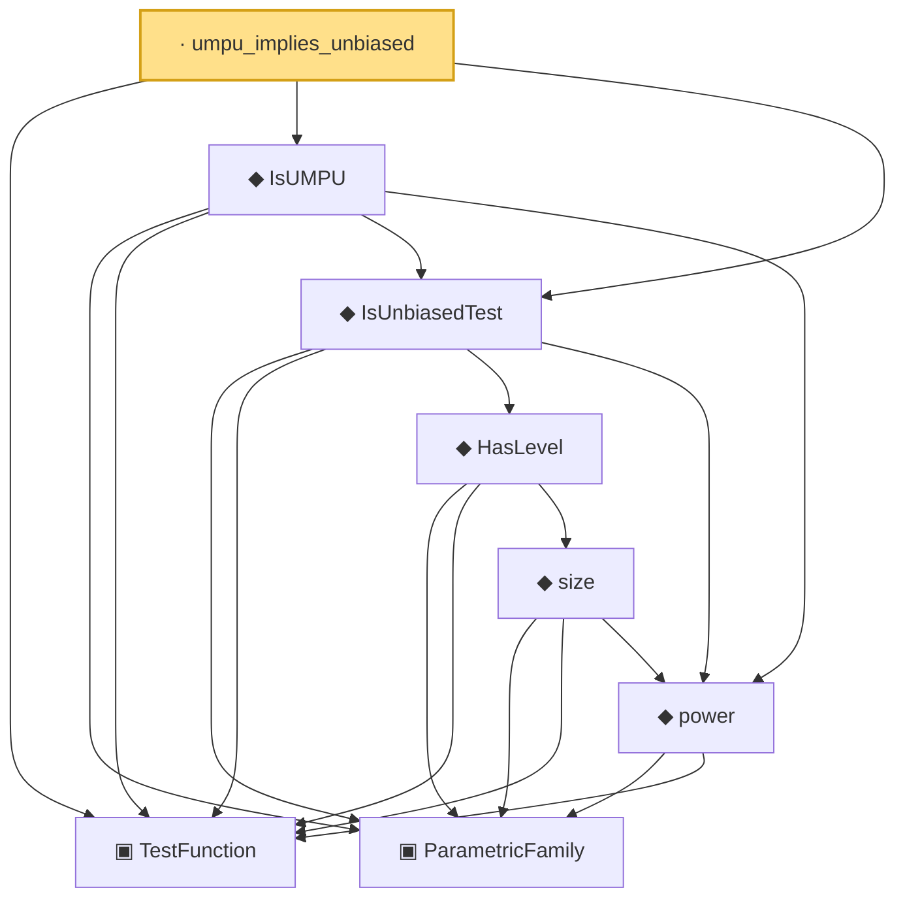

# Proof narrative — umpu_implies_unbiased

Root: **umpu_implies_unbiased** (lemma) `Statlib/HypothesisTesting/UMPU/Basic.lean:135` · topic `HypothesisTesting`
Closure: 8 declarations across 3 files. Generated from `proof_graph.json` — no files were moved.

Reading order (foundations first, headline last):

  ▣ `TestFunction` — structure · `Statlib/HypothesisTesting/Vocabulary.lean:39`  _(also used by 18: power_add_typeII_eq_one, integrable_test_density, thresholdTest, …)_
    ▣ `ParametricFamily` — structure · `Statlib/StatFoundation/Vocabulary/ParametricFamily.lean:22`  _(also used by 6: typeIError, typeIIError, IsUMP, …)_
    ◆ `power` — noncomputable def · `Statlib/HypothesisTesting/Vocabulary.lean:85`  _(also used by 15: power_add_typeII_eq_one, karlin_rubin, karlin_rubin_power_monotone, …)_
        ◆ `size` — noncomputable def · `Statlib/HypothesisTesting/Vocabulary.lean:106`  _(also used by 6: karlin_rubin, neyman_pearson_complete, pvalue_threshold_test_has_level, …)_
      ◆ `HasLevel` — def · `Statlib/HypothesisTesting/Vocabulary.lean:114`  _(also used by 6: karlin_rubin, pvalue_threshold_test_has_level, ump_implies_umpu, …)_
  ◆ `IsUnbiasedTest` — def · `Statlib/HypothesisTesting/Vocabulary.lean:143`  _(also used by 3: ump_implies_umpu, unbiased_has_level, umpu_implies_similar_on_overlap)_
  ◆ `IsUMPU` — def · `Statlib/HypothesisTesting/Vocabulary.lean:158`  _(also used by 1: ump_implies_umpu)_
· `umpu_implies_unbiased` — lemma · `Statlib/HypothesisTesting/UMPU/Basic.lean:135` **← headline**

## Dependency diagram

