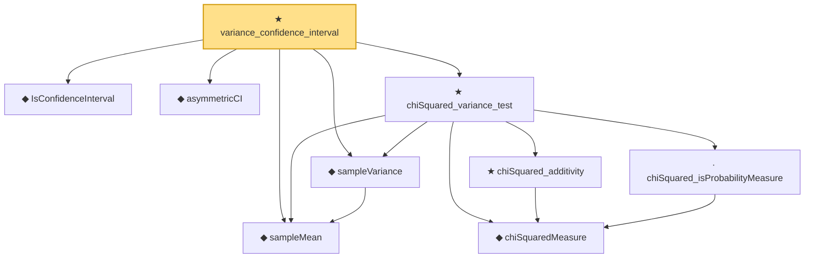

# Proof narrative — variance_confidence_interval

Root: **variance_confidence_interval** (theorem) `Statlib/HypothesisTesting/Inference/NormalTheoryConfidence.lean:455` · topic `HypothesisTesting`
Closure: 9 declarations across 4 files. Generated from `proof_graph.json` — no files were moved.

Reading order (foundations first, headline last):

  ◆ `IsConfidenceInterval` — def · `Statlib/HypothesisTesting/Inference/ConfidenceInterval.lean:33`  _(also used by 4: z_confidence_interval, one_sample_t_confidence_interval, two_sample_t_confidence_interval, …)_
  ◆ `asymmetricCI` — def · `Statlib/HypothesisTesting/Inference/ConfidenceInterval.lean:41`  _(also used by 1: variance_ratio_confidence_interval)_
  ◆ `sampleMean` — def · `Statlib/HypothesisTesting/NormalTheory/VarianceTest.lean:15`  _(also used by 20: mle_asymptotic_normal, wald_statistic_asymptotic_chisq1, tStatistic_aemeasurable, …)_
  ◆ `sampleVariance` — def · `Statlib/HypothesisTesting/NormalTheory/VarianceTest.lean:19`  _(also used by 15: tStatistic_aemeasurable, t_statistic_asymptotic_normal, t_test_consistent, …)_
    ◆ `chiSquaredMeasure` — noncomputable def · `Statlib/StatFoundation/Probability/ChiSquared.lean:22`  _(also used by 11: single_square_law, wald_statistic_asymptotic_chisq1, score_statistic_asymptotic_chisq1, …)_
    · `chiSquared_isProbabilityMeasure` — lemma · `Statlib/StatFoundation/Probability/ChiSquared.lean:39`  _(also used by 4: wald_statistic_asymptotic_chisq1, score_statistic_asymptotic_chisq1, lrt_statistic_asymptotic_chisq1, …)_
    ★ `chiSquared_additivity` — theorem · `Statlib/StatFoundation/Probability/ChiSquared.lean:392`  _(also used by 1: two_sample_pooled_variance_chiSquared)_
  ★ `chiSquared_variance_test` — theorem · `Statlib/HypothesisTesting/NormalTheory/VarianceTest.lean:29`  _(also used by 5: one_sample_t_confidence_interval, one_sample_t_test, two_sample_pooled_variance_chiSquared, …)_
★ `variance_confidence_interval` — theorem · `Statlib/HypothesisTesting/Inference/NormalTheoryConfidence.lean:455` **← headline**

## Dependency diagram

