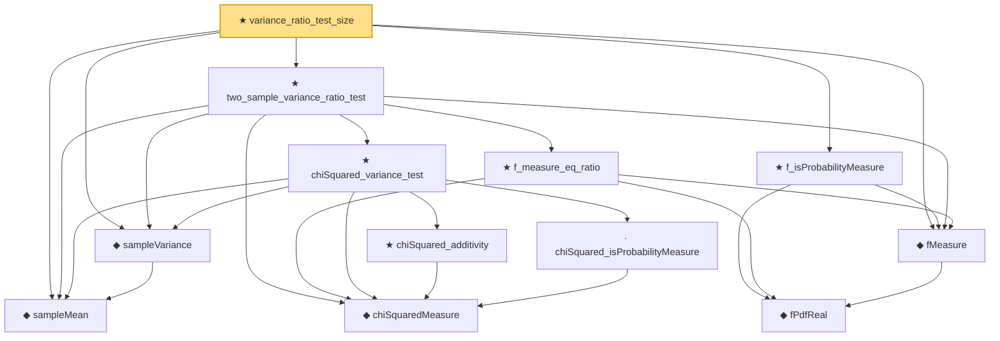

# Proof narrative — variance_ratio_test_size

Root: **variance_ratio_test_size** (theorem) `Statlib/HypothesisTesting/NormalTheory/VarianceTest.lean:2874` · topic `HypothesisTesting`
Closure: 12 declarations across 3 files. Generated from `proof_graph.json` — no files were moved.

Reading order (foundations first, headline last):

    ◆ `fPdfReal` — noncomputable def · `Statlib/StatFoundation/Probability/FDistribution.lean:24`  _(also used by 2: f_mean, f_variance)_
  ◆ `fMeasure` — noncomputable def · `Statlib/StatFoundation/Probability/FDistribution.lean:32`  _(also used by 3: variance_ratio_confidence_interval, f_mean, f_variance)_
  ◆ `sampleMean` — def · `Statlib/HypothesisTesting/NormalTheory/VarianceTest.lean:15`  _(also used by 19: mle_asymptotic_normal, wald_statistic_asymptotic_chisq1, tStatistic_aemeasurable, …)_
  ◆ `sampleVariance` — def · `Statlib/HypothesisTesting/NormalTheory/VarianceTest.lean:19`  _(also used by 14: tStatistic_aemeasurable, t_statistic_asymptotic_normal, t_test_consistent, …)_
    ◆ `chiSquaredMeasure` — noncomputable def · `Statlib/StatFoundation/Probability/ChiSquared.lean:22`  _(also used by 9: single_square_law, wald_statistic_asymptotic_chisq1, score_statistic_asymptotic_chisq1, …)_
      · `chiSquared_isProbabilityMeasure` — lemma · `Statlib/StatFoundation/Probability/ChiSquared.lean:39`  _(also used by 4: wald_statistic_asymptotic_chisq1, score_statistic_asymptotic_chisq1, lrt_statistic_asymptotic_chisq1, …)_
      ★ `chiSquared_additivity` — theorem · `Statlib/StatFoundation/Probability/ChiSquared.lean:392`  _(also used by 1: two_sample_pooled_variance_chiSquared)_
    ★ `chiSquared_variance_test` — theorem · `Statlib/HypothesisTesting/NormalTheory/VarianceTest.lean:29`  _(also used by 5: one_sample_t_confidence_interval, variance_confidence_interval, one_sample_t_test, …)_
    ★ `f_measure_eq_ratio` — theorem · `Statlib/StatFoundation/Probability/FDistribution.lean:544`
  ★ `two_sample_variance_ratio_test` — theorem · `Statlib/HypothesisTesting/NormalTheory/VarianceTest.lean:2365`  _(also used by 1: variance_ratio_confidence_interval)_
  ★ `f_isProbabilityMeasure` — theorem · `Statlib/StatFoundation/Probability/FDistribution.lean:39`  _(also used by 1: f_variance)_
★ `variance_ratio_test_size` — theorem · `Statlib/HypothesisTesting/NormalTheory/VarianceTest.lean:2874` **← headline**

## Dependency diagram

