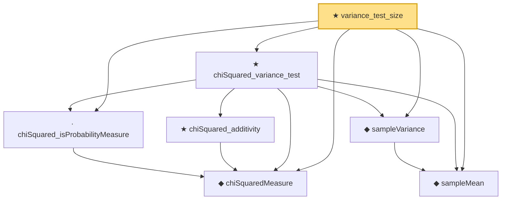

# Proof narrative — variance_test_size

Root: **variance_test_size** (theorem) `Statlib/HypothesisTesting/NormalTheory/VarianceTest.lean:2826` · topic `HypothesisTesting`
Closure: 7 declarations across 2 files. Generated from `proof_graph.json` — no files were moved.

Reading order (foundations first, headline last):

  ◆ `chiSquaredMeasure` — noncomputable def · `Statlib/StatFoundation/Probability/ChiSquared.lean:22`  _(also used by 10: single_square_law, wald_statistic_asymptotic_chisq1, score_statistic_asymptotic_chisq1, …)_
  ◆ `sampleMean` — def · `Statlib/HypothesisTesting/NormalTheory/VarianceTest.lean:15`  _(also used by 20: mle_asymptotic_normal, wald_statistic_asymptotic_chisq1, tStatistic_aemeasurable, …)_
  ◆ `sampleVariance` — def · `Statlib/HypothesisTesting/NormalTheory/VarianceTest.lean:19`  _(also used by 15: tStatistic_aemeasurable, t_statistic_asymptotic_normal, t_test_consistent, …)_
  · `chiSquared_isProbabilityMeasure` — lemma · `Statlib/StatFoundation/Probability/ChiSquared.lean:39`  _(also used by 3: wald_statistic_asymptotic_chisq1, score_statistic_asymptotic_chisq1, lrt_statistic_asymptotic_chisq1)_
    ★ `chiSquared_additivity` — theorem · `Statlib/StatFoundation/Probability/ChiSquared.lean:392`  _(also used by 1: two_sample_pooled_variance_chiSquared)_
  ★ `chiSquared_variance_test` — theorem · `Statlib/HypothesisTesting/NormalTheory/VarianceTest.lean:29`  _(also used by 5: one_sample_t_confidence_interval, variance_confidence_interval, one_sample_t_test, …)_
★ `variance_test_size` — theorem · `Statlib/HypothesisTesting/NormalTheory/VarianceTest.lean:2826` **← headline**

## Dependency diagram

