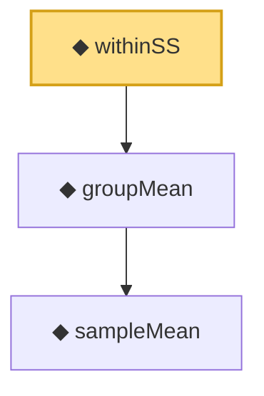

# Proof narrative — withinSS

Root: **withinSS** (def) `Statlib/HypothesisTesting/NormalTheory/ANOVA.lean:22` · topic `HypothesisTesting`
Closure: 3 declarations across 2 files. Generated from `proof_graph.json` — no files were moved.

Reading order (foundations first, headline last):

    ◆ `sampleMean` — def · `Statlib/HypothesisTesting/NormalTheory/VarianceTest.lean:15`  _(also used by 22: mle_asymptotic_normal, wald_statistic_asymptotic_chisq1, tStatistic_aemeasurable, …)_
  ◆ `groupMean` — def · `Statlib/HypothesisTesting/NormalTheory/ANOVA.lean:10`  _(also used by 1: betweenSS)_
◆ `withinSS` — def · `Statlib/HypothesisTesting/NormalTheory/ANOVA.lean:22` **← headline**

## Dependency diagram

