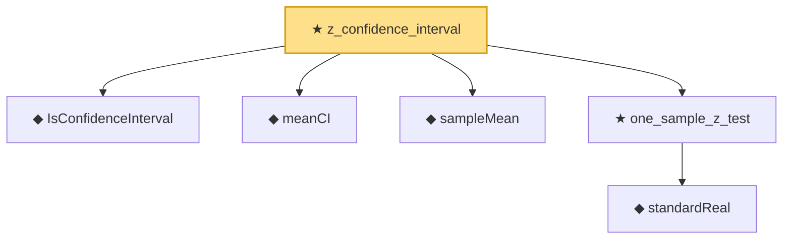

# Proof narrative — z_confidence_interval

Root: **z_confidence_interval** (theorem) `Statlib/HypothesisTesting/Inference/NormalTheoryConfidence.lean:39` · topic `HypothesisTesting`
Closure: 6 declarations across 5 files. Generated from `proof_graph.json` — no files were moved.

Reading order (foundations first, headline last):

  ◆ `IsConfidenceInterval` — def · `Statlib/HypothesisTesting/Inference/ConfidenceInterval.lean:33`  _(also used by 4: one_sample_t_confidence_interval, two_sample_t_confidence_interval, variance_confidence_interval, …)_
  ◆ `meanCI` — def · `Statlib/HypothesisTesting/Inference/ConfidenceInterval.lean:27`  _(also used by 2: one_sample_t_confidence_interval, two_sample_t_confidence_interval)_
  ◆ `sampleMean` — def · `Statlib/HypothesisTesting/NormalTheory/VarianceTest.lean:15`  _(also used by 22: mle_asymptotic_normal, wald_statistic_asymptotic_chisq1, tStatistic_aemeasurable, …)_
    ◆ `standardReal` — abbrev · `Statlib/StatFoundation/RandomVariable/Gaussian/Standard.lean:31`  _(also used by 81: single_square_law, wald_statistic_asymptotic_chisq1, score_statistic_asymptotic_chisq1, …)_
  ★ `one_sample_z_test` — theorem · `Statlib/HypothesisTesting/NormalTheory/ZTest.lean:14`  _(also used by 1: one_sample_t_test)_
★ `z_confidence_interval` — theorem · `Statlib/HypothesisTesting/Inference/NormalTheoryConfidence.lean:39` **← headline**

## Dependency diagram

