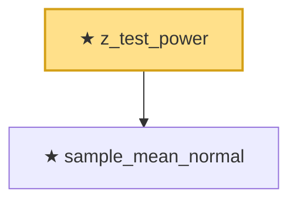

# Proof narrative — z_test_power

Root: **z_test_power** (theorem) `Statlib/HypothesisTesting/NormalTheory/ZTest.lean:123` · topic `HypothesisTesting`
Closure: 2 declarations across 2 files. Generated from `proof_graph.json` — no files were moved.

Reading order (foundations first, headline last):

  ★ `sample_mean_normal` — theorem · `Statlib/HypothesisTesting/NormalTheory/SampleMean.lean:9`  _(also used by 1: two_sample_mean_diff_normal)_
★ `z_test_power` — theorem · `Statlib/HypothesisTesting/NormalTheory/ZTest.lean:123` **← headline**

## Dependency diagram

