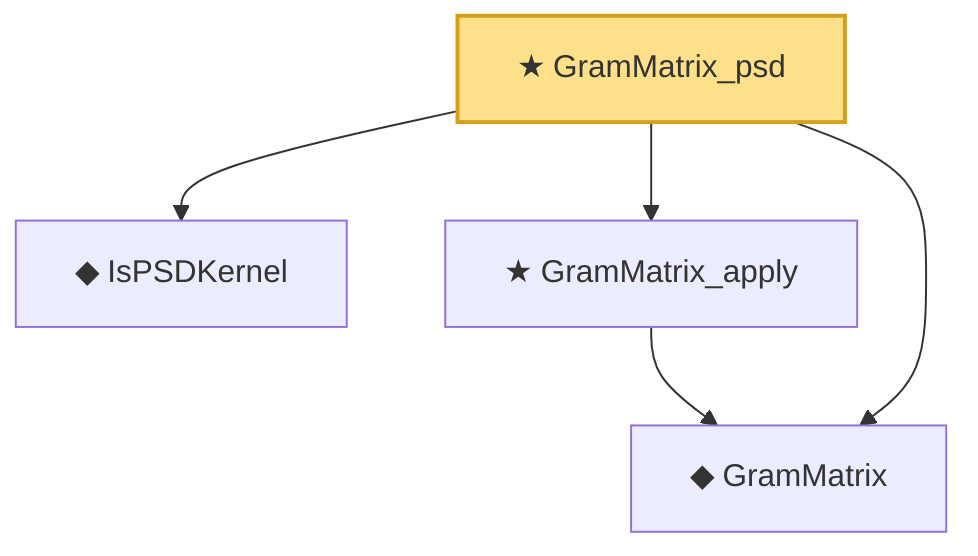

# Proof narrative — GramMatrix_psd

Root: **GramMatrix_psd** (theorem) `Statlib/Kernel/GramMatrix_psd.lean:14` · topic `Kernel`
Closure: 4 declarations across 4 files. Generated from `proof_graph.json` — no files were moved.

Reading order (foundations first, headline last):

  ◆ `IsPSDKernel` — def · `Statlib/Kernel/IsPSDKernel.lean:11`  _(also used by 1: representer_theorem)_
  ◆ `GramMatrix` — def · `Statlib/Kernel/GramMatrix.lean:13`  _(also used by 2: GramMatrix_symm, regularizedGram)_
  ★ `GramMatrix_apply` — theorem · `Statlib/Kernel/GramMatrix_apply.lean:11`  _(also used by 2: GramMatrix_symm, regularizedGram_diag)_
★ `GramMatrix_psd` — theorem · `Statlib/Kernel/GramMatrix_psd.lean:14` **← headline**

## Dependency diagram

