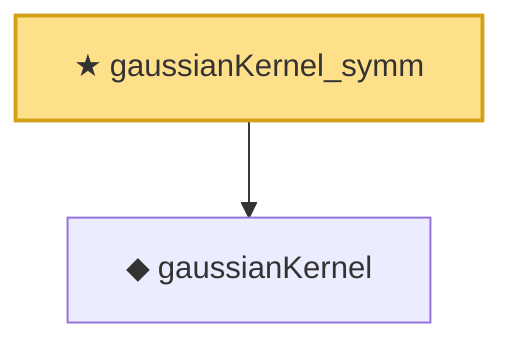

# Proof narrative — gaussianKernel_symm

Root: **gaussianKernel_symm** (theorem) `Statlib/Kernel/gaussianKernel_symm.lean:11` · topic `Kernel`
Closure: 2 declarations across 2 files. Generated from `proof_graph.json` — no files were moved.

Reading order (foundations first, headline last):

  ◆ `gaussianKernel` — noncomputable def · `Statlib/Kernel/gaussianKernel.lean:10`  _(also used by 3: gaussianKernel_le_one, gaussianKernel_pos, gaussianKernel_self)_
★ `gaussianKernel_symm` — theorem · `Statlib/Kernel/gaussianKernel_symm.lean:11` **← headline**

## Dependency diagram

