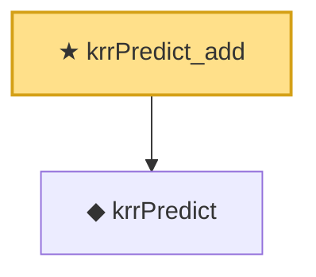

# Proof narrative — krrPredict_add

Root: **krrPredict_add** (theorem) `Statlib/Kernel/krrPredict_add.lean:11` · topic `Kernel`
Closure: 2 declarations across 2 files. Generated from `proof_graph.json` — no files were moved.

Reading order (foundations first, headline last):

  ◆ `krrPredict` — noncomputable def · `Statlib/Kernel/krrPredict.lean:16`  _(also used by 2: krrPredict_smul, krrPredict_zero)_
★ `krrPredict_add` — theorem · `Statlib/Kernel/krrPredict_add.lean:11` **← headline**

## Dependency diagram

