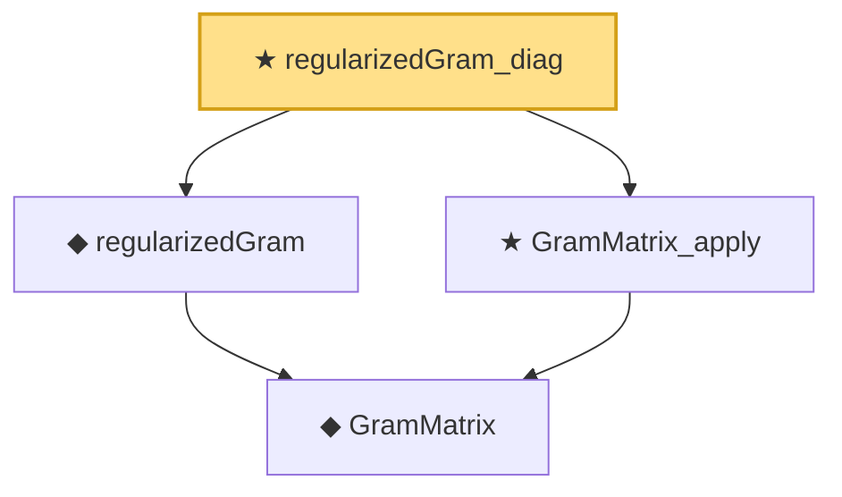

# Proof narrative — regularizedGram_diag

Root: **regularizedGram_diag** (theorem) `Statlib/Kernel/regularizedGram_diag.lean:14` · topic `Kernel`
Closure: 4 declarations across 4 files. Generated from `proof_graph.json` — no files were moved.

Reading order (foundations first, headline last):

    ◆ `GramMatrix` — def · `Statlib/Kernel/GramMatrix.lean:13`  _(also used by 2: GramMatrix_psd, GramMatrix_symm)_
  ◆ `regularizedGram` — noncomputable def · `Statlib/Kernel/regularizedGram.lean:14`  _(also used by 1: regularizedGram_symm)_
  ★ `GramMatrix_apply` — theorem · `Statlib/Kernel/GramMatrix_apply.lean:11`  _(also used by 2: GramMatrix_psd, GramMatrix_symm)_
★ `regularizedGram_diag` — theorem · `Statlib/Kernel/regularizedGram_diag.lean:14` **← headline**

## Dependency diagram

