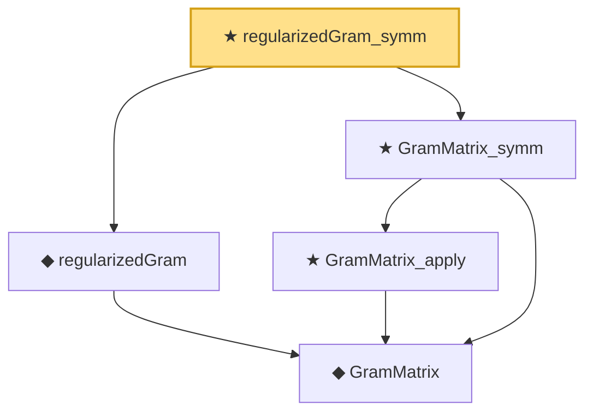

# Proof narrative — regularizedGram_symm

Root: **regularizedGram_symm** (theorem) `Statlib/Kernel/regularizedGram_symm.lean:14` · topic `Kernel`
Closure: 5 declarations across 5 files. Generated from `proof_graph.json` — no files were moved.

Reading order (foundations first, headline last):

    ◆ `GramMatrix` — def · `Statlib/Kernel/GramMatrix.lean:13`  _(also used by 1: GramMatrix_psd)_
  ◆ `regularizedGram` — noncomputable def · `Statlib/Kernel/regularizedGram.lean:14`  _(also used by 1: regularizedGram_diag)_
    ★ `GramMatrix_apply` — theorem · `Statlib/Kernel/GramMatrix_apply.lean:11`  _(also used by 2: GramMatrix_psd, regularizedGram_diag)_
  ★ `GramMatrix_symm` — theorem · `Statlib/Kernel/GramMatrix_symm.lean:12`
★ `regularizedGram_symm` — theorem · `Statlib/Kernel/regularizedGram_symm.lean:14` **← headline**

## Dependency diagram

