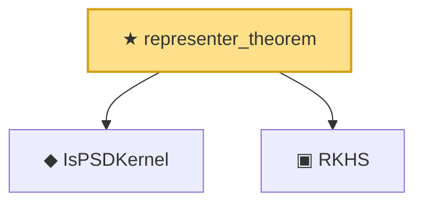

# Proof narrative — representer_theorem

Root: **representer_theorem** (theorem) `Statlib/Kernel/representer_theorem.lean:15` · topic `Kernel`
Closure: 3 declarations across 3 files. Generated from `proof_graph.json` — no files were moved.

Reading order (foundations first, headline last):

  ◆ `IsPSDKernel` — def · `Statlib/Kernel/IsPSDKernel.lean:11`  _(also used by 1: GramMatrix_psd)_
  ▣ `RKHS` — structure · `Statlib/Kernel/RKHS.lean:42`
★ `representer_theorem` — theorem · `Statlib/Kernel/representer_theorem.lean:15` **← headline**

## Dependency diagram

