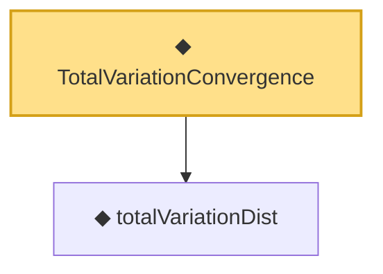

# Proof narrative — TotalVariationConvergence

Root: **TotalVariationConvergence** (def) `Statlib/LimitTheorems/TotalVariationConvergence.lean:31` · topic `LimitTheorems`
Closure: 2 declarations across 2 files. Generated from `proof_graph.json` — no files were moved.

Reading order (foundations first, headline last):

  ◆ `totalVariationDist` — noncomputable def · `Statlib/LimitTheorems/totalVariationDist.lean:29`
◆ `TotalVariationConvergence` — def · `Statlib/LimitTheorems/TotalVariationConvergence.lean:31` **← headline**

## Dependency diagram

