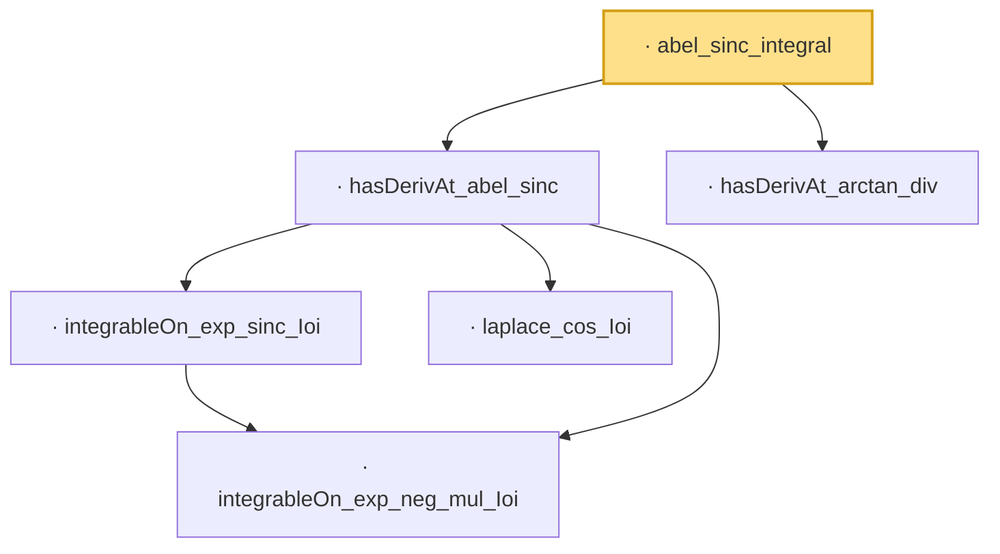

# Proof narrative — abel_sinc_integral

Root: **abel_sinc_integral** (lemma) `Statlib/LimitTheorems/abel_sinc_integral.lean:19` · topic `LimitTheorems`
Closure: 6 declarations across 6 files. Generated from `proof_graph.json` — no files were moved.

Reading order (foundations first, headline last):

    · `integrableOn_exp_neg_mul_Ioi` — lemma · `Statlib/Fourier/integrableOn_exp_neg_mul_Ioi.lean:7`  _(also used by 4: hasDerivAt_abel_sinc_sq, integrableOn_exp_sinc_sq_Ioi, hasDerivAt_abel_sinc, …)_
    · `integrableOn_exp_sinc_Ioi` — lemma · `Statlib/Fourier/integrableOn_exp_sinc_Ioi.lean:8`  _(also used by 1: hasDerivAt_abel_sinc)_
    · `laplace_cos_Ioi` — lemma · `Statlib/Fourier/laplace_cos_Ioi.lean:9`  _(also used by 1: hasDerivAt_abel_sinc)_
  · `hasDerivAt_abel_sinc` — lemma · `Statlib/Fourier/hasDerivAt_abel_sinc.lean:12`  _(also used by 1: abel_sinc_integral)_
  · `hasDerivAt_arctan_div` — lemma · `Statlib/Fourier/hasDerivAt_arctan_div.lean:7`  _(also used by 1: abel_sinc_integral)_
· `abel_sinc_integral` — lemma · `Statlib/LimitTheorems/abel_sinc_integral.lean:19` **← headline**

## Dependency diagram

