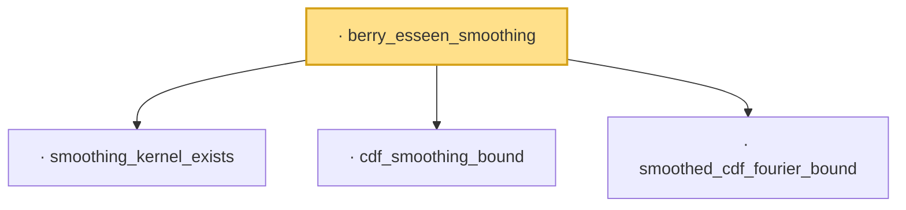

# Proof narrative — berry_esseen_smoothing

Root: **berry_esseen_smoothing** (lemma) `Statlib/LimitTheorems/berry_esseen_smoothing.lean:13` · topic `LimitTheorems`
Closure: 4 declarations across 4 files. Generated from `proof_graph.json` — no files were moved.

Reading order (foundations first, headline last):

  · `smoothing_kernel_exists` — lemma · `Statlib/LimitTheorems/smoothing_kernel_exists.lean:10`
  · `cdf_smoothing_bound` — lemma · `Statlib/LimitTheorems/cdf_smoothing_bound.lean:10`
  · `smoothed_cdf_fourier_bound` — lemma · `Statlib/LimitTheorems/smoothed_cdf_fourier_bound.lean:24`
· `berry_esseen_smoothing` — lemma · `Statlib/LimitTheorems/berry_esseen_smoothing.lean:13` **← headline**

## Dependency diagram

