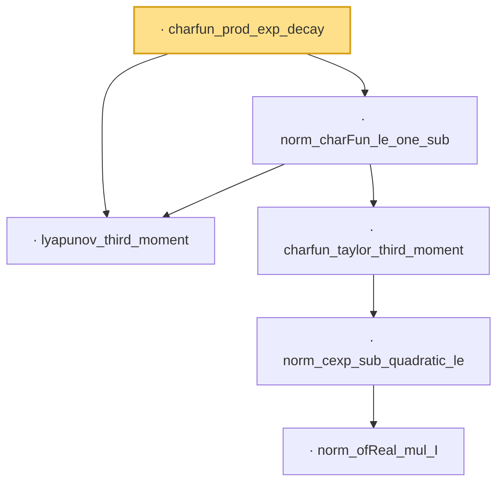

# Proof narrative — charfun_prod_exp_decay

Root: **charfun_prod_exp_decay** (lemma) `Statlib/LimitTheorems/charfun_prod_exp_decay.lean:13` · topic `LimitTheorems`
Closure: 6 declarations across 6 files. Generated from `proof_graph.json` — no files were moved.

Reading order (foundations first, headline last):

  · `lyapunov_third_moment` — lemma · `Statlib/CharFun/lyapunov_third_moment.lean:19`  _(also used by 5: charfun_normalized_sum_bound, charfun_diff_exp_bound, charfun_integral_bound, …)_
        · `norm_ofReal_mul_I` — lemma · `Statlib/CharFun/norm_ofReal_mul_I.lean:17`  _(also used by 1: norm_cexp_sub_quadratic_le_third)_
      · `norm_cexp_sub_quadratic_le` — lemma · `Statlib/CharFun/norm_cexp_sub_quadratic_le.lean:19`  _(also used by 2: charfun_error_le_j, norm_cexp_sub_quadratic_le_sq)_
    · `charfun_taylor_third_moment` — lemma · `Statlib/CharFun/charfun_taylor_third_moment.lean:22`  _(also used by 2: charfun_prod_vs_pow_bound, charfun_diff_exp_bound)_
  · `norm_charFun_le_one_sub` — lemma · `Statlib/LimitTheorems/norm_charFun_le_one_sub.lean:12`  _(also used by 1: charfun_diff_exp_bound)_
· `charfun_prod_exp_decay` — lemma · `Statlib/LimitTheorems/charfun_prod_exp_decay.lean:13` **← headline**

## Dependency diagram

