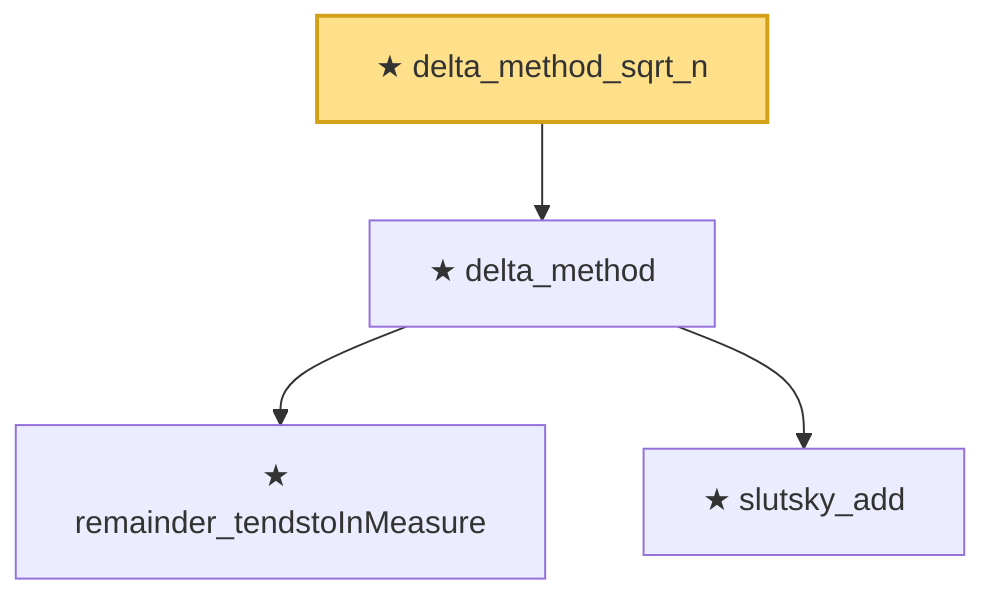

# Proof narrative — delta_method_sqrt_n

Root: **delta_method_sqrt_n** (theorem) `Statlib/LimitTheorems/delta_method_sqrt_n.lean:20` · topic `LimitTheorems`
Closure: 4 declarations across 4 files. Generated from `proof_graph.json` — no files were moved.

Reading order (foundations first, headline last):

    ★ `remainder_tendstoInMeasure` — theorem · `Statlib/LimitTheorems/remainder_tendstoInMeasure.lean:20`
    ★ `slutsky_add` — theorem · `Statlib/LimitTheorems/slutsky_add.lean:16`
  ★ `delta_method` — theorem · `Statlib/LimitTheorems/delta_method.lean:24`  _(also used by 1: amse_delta_method_convergence)_
★ `delta_method_sqrt_n` — theorem · `Statlib/LimitTheorems/delta_method_sqrt_n.lean:20` **← headline**

## Dependency diagram

