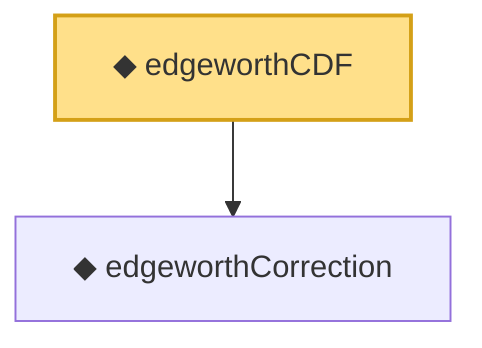

# Proof narrative — edgeworthCDF

Root: **edgeworthCDF** (noncomputable def) `Statlib/LimitTheorems/edgeworthCDF.lean:27` · topic `LimitTheorems`
Closure: 2 declarations across 2 files. Generated from `proof_graph.json` — no files were moved.

Reading order (foundations first, headline last):

  ◆ `edgeworthCorrection` — noncomputable def · `Statlib/LimitTheorems/edgeworthCorrection.lean:26`
◆ `edgeworthCDF` — noncomputable def · `Statlib/LimitTheorems/edgeworthCDF.lean:27` **← headline**

## Dependency diagram

