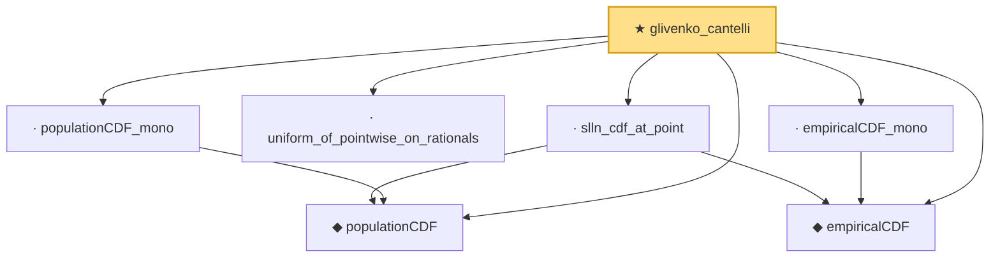

# Proof narrative — glivenko_cantelli

Root: **glivenko_cantelli** (theorem) `Statlib/LimitTheorems/glivenko_cantelli.lean:43` · topic `LimitTheorems`
Closure: 7 declarations across 7 files. Generated from `proof_graph.json` — no files were moved.

Reading order (foundations first, headline last):

  ◆ `populationCDF` — noncomputable def · `Statlib/LimitTheorems/populationCDF.lean:25`
  ◆ `empiricalCDF` — noncomputable def · `Statlib/LimitTheorems/empiricalCDF.lean:25`
  · `slln_cdf_at_point` — lemma · `Statlib/LimitTheorems/slln_cdf_at_point.lean:30`
  · `uniform_of_pointwise_on_rationals` — lemma · `Statlib/LimitTheorems/uniform_of_pointwise_on_rationals.lean:33`
  · `empiricalCDF_mono` — lemma · `Statlib/LimitTheorems/empiricalCDF_mono.lean:26`
  · `populationCDF_mono` — lemma · `Statlib/LimitTheorems/populationCDF_mono.lean:25`
★ `glivenko_cantelli` — theorem · `Statlib/LimitTheorems/glivenko_cantelli.lean:43` **← headline**

## Dependency diagram

