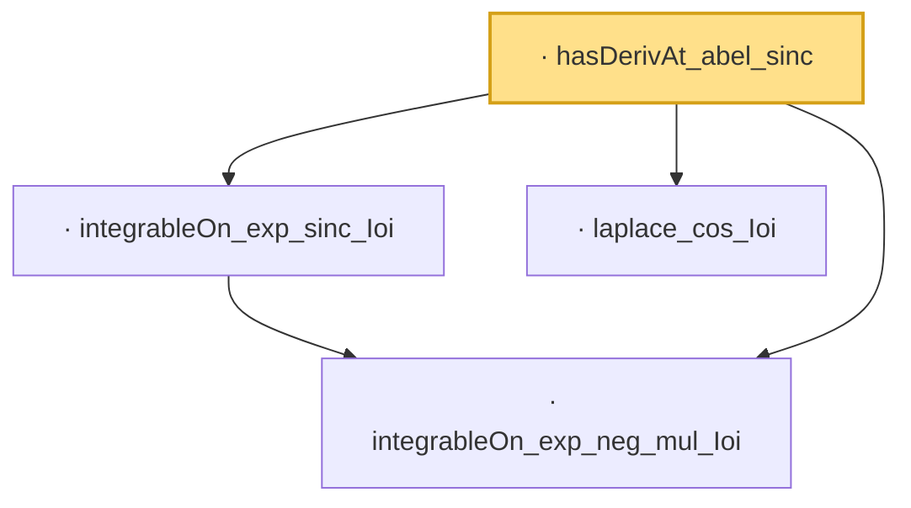

# Proof narrative — hasDerivAt_abel_sinc

Root: **hasDerivAt_abel_sinc** (lemma) `Statlib/LimitTheorems/hasDerivAt_abel_sinc.lean:16` · topic `LimitTheorems`
Closure: 4 declarations across 4 files. Generated from `proof_graph.json` — no files were moved.

Reading order (foundations first, headline last):

  · `integrableOn_exp_neg_mul_Ioi` — lemma · `Statlib/Fourier/integrableOn_exp_neg_mul_Ioi.lean:7`  _(also used by 4: hasDerivAt_abel_sinc, hasDerivAt_abel_sinc_sq, integrableOn_exp_sinc_sq_Ioi, …)_
  · `integrableOn_exp_sinc_Ioi` — lemma · `Statlib/Fourier/integrableOn_exp_sinc_Ioi.lean:8`  _(also used by 1: hasDerivAt_abel_sinc)_
  · `laplace_cos_Ioi` — lemma · `Statlib/Fourier/laplace_cos_Ioi.lean:9`  _(also used by 1: hasDerivAt_abel_sinc)_
· `hasDerivAt_abel_sinc` — lemma · `Statlib/LimitTheorems/hasDerivAt_abel_sinc.lean:16` **← headline**

## Dependency diagram

