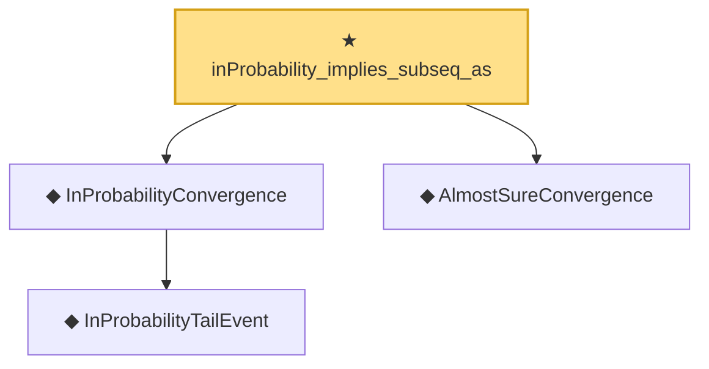

# Proof narrative — inProbability_implies_subseq_as

Root: **inProbability_implies_subseq_as** (theorem) `Statlib/LimitTheorems/inProbability_implies_subseq_as.lean:30` · topic `LimitTheorems`
Closure: 4 declarations across 4 files. Generated from `proof_graph.json` — no files were moved.

Reading order (foundations first, headline last):

    ◆ `InProbabilityTailEvent` — def · `Statlib/LimitTheorems/InProbabilityTailEvent.lean:26`  _(also used by 2: CompleteConvergence, as_implies_inProbability)_
  ◆ `InProbabilityConvergence` — def · `Statlib/LimitTheorems/InProbabilityConvergence.lean:31`  _(also used by 1: as_implies_inProbability)_
  ◆ `AlmostSureConvergence` — def · `Statlib/LimitTheorems/AlmostSureConvergence.lean:31`  _(also used by 2: as_implies_inProbability, complete_implies_as)_
★ `inProbability_implies_subseq_as` — theorem · `Statlib/LimitTheorems/inProbability_implies_subseq_as.lean:30` **← headline**

## Dependency diagram

