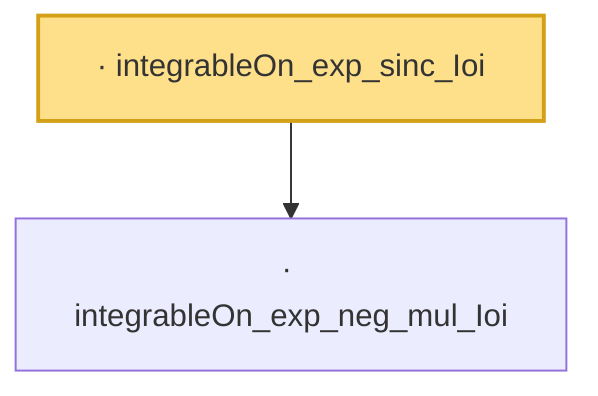

# Proof narrative — integrableOn_exp_sinc_Ioi

Root: **integrableOn_exp_sinc_Ioi** (lemma) `Statlib/LimitTheorems/integrableOn_exp_sinc_Ioi.lean:12` · topic `LimitTheorems`
Closure: 2 declarations across 2 files. Generated from `proof_graph.json` — no files were moved.

Reading order (foundations first, headline last):

  · `integrableOn_exp_neg_mul_Ioi` — lemma · `Statlib/Fourier/integrableOn_exp_neg_mul_Ioi.lean:7`  _(also used by 4: hasDerivAt_abel_sinc, hasDerivAt_abel_sinc_sq, integrableOn_exp_sinc_Ioi, …)_
· `integrableOn_exp_sinc_Ioi` — lemma · `Statlib/LimitTheorems/integrableOn_exp_sinc_Ioi.lean:12` **← headline**

## Dependency diagram

