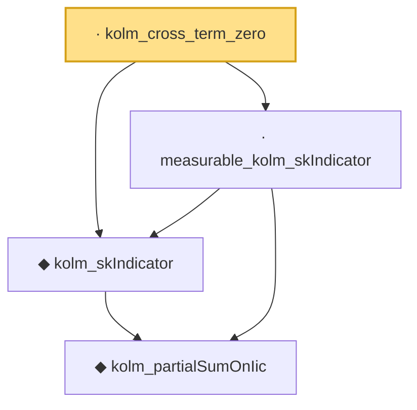

# Proof narrative — kolm_cross_term_zero

Root: **kolm_cross_term_zero** (lemma) `Statlib/LimitTheorems/kolm_cross_term_zero.lean:30` · topic `LimitTheorems`
Closure: 4 declarations across 4 files. Generated from `proof_graph.json` — no files were moved.

Reading order (foundations first, headline last):

    ◆ `kolm_partialSumOnIic` — noncomputable def · `Statlib/LimitTheorems/kolm_partialSumOnIic.lean:28`  _(also used by 2: kolm_partialSumOnIic_eq, kolm_skIndicator_eq_indicator)_
  ◆ `kolm_skIndicator` — noncomputable def · `Statlib/LimitTheorems/kolm_skIndicator.lean:29`  _(also used by 1: kolm_skIndicator_eq_indicator)_
  · `measurable_kolm_skIndicator` — lemma · `Statlib/LimitTheorems/measurable_kolm_skIndicator.lean:28`
· `kolm_cross_term_zero` — lemma · `Statlib/LimitTheorems/kolm_cross_term_zero.lean:30` **← headline**

## Dependency diagram

