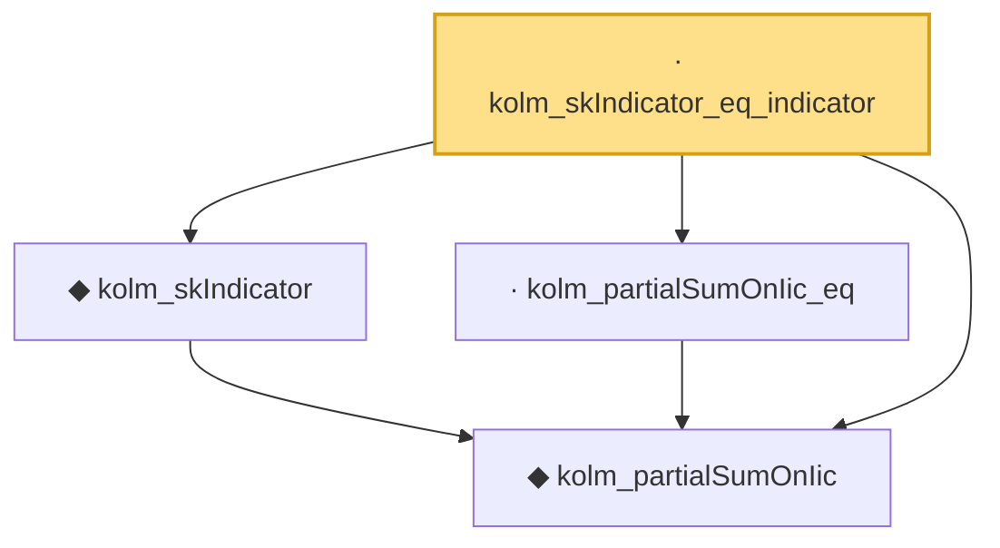

# Proof narrative — kolm_skIndicator_eq_indicator

Root: **kolm_skIndicator_eq_indicator** (lemma) `Statlib/LimitTheorems/kolm_skIndicator_eq_indicator.lean:31` · topic `LimitTheorems`
Closure: 4 declarations across 4 files. Generated from `proof_graph.json` — no files were moved.

Reading order (foundations first, headline last):

  ◆ `kolm_partialSumOnIic` — noncomputable def · `Statlib/LimitTheorems/kolm_partialSumOnIic.lean:28`  _(also used by 1: measurable_kolm_skIndicator)_
  ◆ `kolm_skIndicator` — noncomputable def · `Statlib/LimitTheorems/kolm_skIndicator.lean:29`  _(also used by 2: kolm_cross_term_zero, measurable_kolm_skIndicator)_
  · `kolm_partialSumOnIic_eq` — lemma · `Statlib/LimitTheorems/kolm_partialSumOnIic_eq.lean:27`
· `kolm_skIndicator_eq_indicator` — lemma · `Statlib/LimitTheorems/kolm_skIndicator_eq_indicator.lean:31` **← headline**

## Dependency diagram

