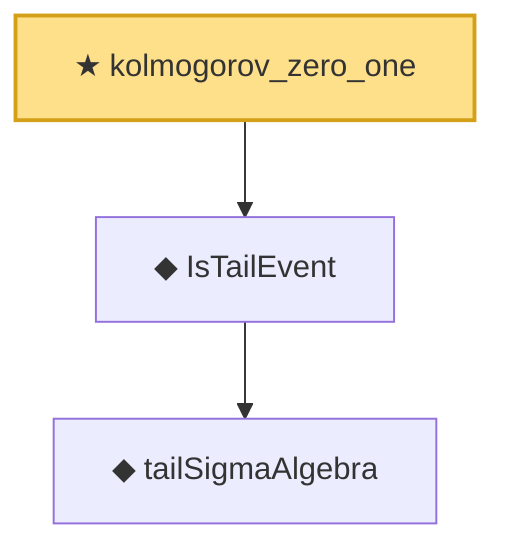

# Proof narrative — kolmogorov_zero_one

Root: **kolmogorov_zero_one** (theorem) `Statlib/LimitTheorems/kolmogorov_zero_one.lean:30` · topic `LimitTheorems`
Closure: 3 declarations across 3 files. Generated from `proof_graph.json` — no files were moved.

Reading order (foundations first, headline last):

    ◆ `tailSigmaAlgebra` — def · `Statlib/LimitTheorems/tailSigmaAlgebra.lean:27`
  ◆ `IsTailEvent` — def · `Statlib/LimitTheorems/IsTailEvent.lean:27`
★ `kolmogorov_zero_one` — theorem · `Statlib/LimitTheorems/kolmogorov_zero_one.lean:30` **← headline**

## Dependency diagram

