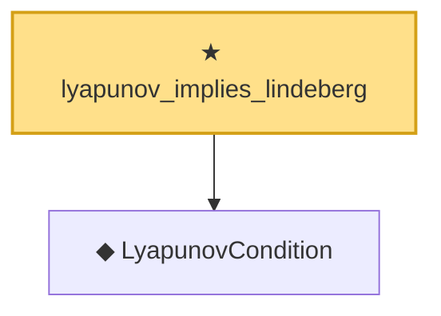

# Proof narrative — lyapunov_implies_lindeberg

Root: **lyapunov_implies_lindeberg** (theorem) `Statlib/LimitTheorems/lyapunov_implies_lindeberg.lean:29` · topic `LimitTheorems`
Closure: 2 declarations across 2 files. Generated from `proof_graph.json` — no files were moved.

Reading order (foundations first, headline last):

  ◆ `LyapunovCondition` — def · `Statlib/LimitTheorems/LyapunovCondition.lean:27`
★ `lyapunov_implies_lindeberg` — theorem · `Statlib/LimitTheorems/lyapunov_implies_lindeberg.lean:29` **← headline**

## Dependency diagram

