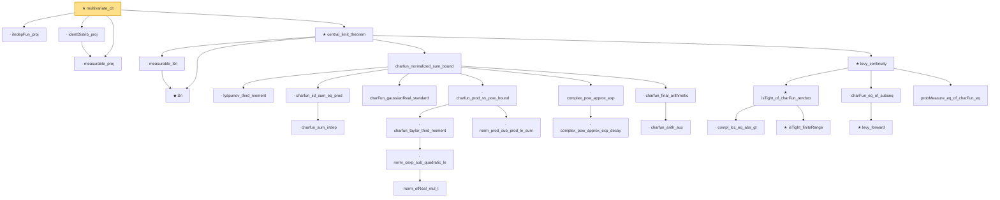

# Proof narrative — multivariate_clt

Root: **multivariate_clt** (theorem) `Statlib/LimitTheorems/multivariate_clt.lean:38` · topic `LimitTheorems`
Closure: 28 declarations across 28 files. Generated from `proof_graph.json` — no files were moved.

Reading order (foundations first, headline last):

  · `measurable_proj` — lemma · `Statlib/LimitTheorems/measurable_proj.lean:25`
  · `iIndepFun_proj` — lemma · `Statlib/LimitTheorems/iIndepFun_proj.lean:26`
  · `identDistrib_proj` — lemma · `Statlib/LimitTheorems/identDistrib_proj.lean:27`
    ◆ `Sn` — abbrev · `Statlib/LimitTheorems/Sn.lean:13`
    · `measurable_Sn` — lemma · `Statlib/LimitTheorems/measurable_Sn.lean:13`
      · `lyapunov_third_moment` — lemma · `Statlib/CharFun/lyapunov_third_moment.lean:19`  _(also used by 6: charfun_diff_exp_bound, charfun_integral_bound, charfun_integrand_bound, …)_
        · `charfun_sum_indep` — lemma · `Statlib/CharFun/charfun_sum_indep.lean:19`
      · `charfun_iid_sum_eq_prod` — lemma · `Statlib/CharFun/charfun_iid_sum_eq_prod.lean:20`  _(also used by 2: charfun_diff_exp_bound, charfun_diff_taylor_bound)_
      · `charFun_gaussianReal_standard` — lemma · `Statlib/CharFun/charFun_gaussianReal_standard.lean:18`  _(also used by 3: charfun_diff_exp_bound, charfun_diff_taylor_bound, lindeberg_feller_clt)_
            · `norm_ofReal_mul_I` — lemma · `Statlib/CharFun/norm_ofReal_mul_I.lean:17`  _(also used by 1: norm_cexp_sub_quadratic_le_third)_
          · `norm_cexp_sub_quadratic_le` — lemma · `Statlib/CharFun/norm_cexp_sub_quadratic_le.lean:19`  _(also used by 2: charfun_error_le_j, norm_cexp_sub_quadratic_le_sq)_
        · `charfun_taylor_third_moment` — lemma · `Statlib/CharFun/charfun_taylor_third_moment.lean:22`  _(also used by 2: charfun_diff_exp_bound, norm_charFun_le_one_sub)_
        · `norm_prod_sub_prod_le_sum` — lemma · `Statlib/CharFun/norm_prod_sub_prod_le_sum.lean:19`
      · `charfun_prod_vs_pow_bound` — lemma · `Statlib/CharFun/charfun_prod_vs_pow_bound.lean:21`  _(also used by 1: charfun_diff_taylor_bound)_
        · `complex_pow_approx_exp_decay` — lemma · `Statlib/CharFun/complex_pow_approx_exp_decay.lean:21`  _(also used by 1: charfun_diff_exp_bound)_
      · `complex_pow_approx_exp` — lemma · `Statlib/CharFun/complex_pow_approx_exp.lean:18`  _(also used by 1: charfun_diff_taylor_bound)_
        · `charfun_arith_aux` — lemma · `Statlib/CharFun/charfun_arith_aux.lean:17`
      · `charfun_final_arithmetic` — lemma · `Statlib/CharFun/charfun_final_arithmetic.lean:18`
    · `charfun_normalized_sum_bound` — lemma · `Statlib/CharFun/charfun_normalized_sum_bound.lean:32`
        · `compl_Icc_eq_abs_gt` — lemma · `Statlib/LimitTheorems/compl_Icc_eq_abs_gt.lean:16`
        ★ `isTight_finiteRange` — theorem · `Statlib/LimitTheorems/isTight_finiteRange.lean:16`
      ★ `isTight_of_charFun_tendsto` — theorem · `Statlib/LimitTheorems/isTight_of_charFun_tendsto.lean:23`  _(also used by 1: isTight_of_charFun_tendsto_inner)_
        ★ `levy_forward` — theorem · `Statlib/LimitTheorems/levy_forward.lean:20`  _(also used by 3: clt_isAsymptoticallyNormal, cramer_wold_reverse, ustatistic_clt_nondegenerate)_
      · `charFun_eq_of_subseq` — lemma · `Statlib/LimitTheorems/charFun_eq_of_subseq.lean:17`
      · `probMeasure_eq_of_charFun_eq` — lemma · `Statlib/LimitTheorems/probMeasure_eq_of_charFun_eq.lean:17`
    ★ `levy_continuity` — theorem · `Statlib/LimitTheorems/levy_continuity.lean:25`  _(also used by 2: lindeberg_feller_clt, gaussian_limit_of_charfun_convergence)_
  ★ `central_limit_theorem` — theorem · `Statlib/LimitTheorems/central_limit_theorem.lean:20`
★ `multivariate_clt` — theorem · `Statlib/LimitTheorems/multivariate_clt.lean:38` **← headline**

## Dependency diagram

