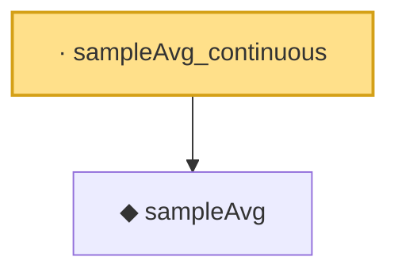

# Proof narrative — sampleAvg_continuous

Root: **sampleAvg_continuous** (lemma) `Statlib/LimitTheorems/sampleAvg_continuous.lean:12` · topic `LimitTheorems`
Closure: 2 declarations across 2 files. Generated from `proof_graph.json` — no files were moved.

Reading order (foundations first, headline last):

  ◆ `sampleAvg` — noncomputable def · `Statlib/LimitTheorems/sampleAvg.lean:12`  _(also used by 3: slln_finset_ae, slln_pointwise, uniform_slln)_
· `sampleAvg_continuous` — lemma · `Statlib/LimitTheorems/sampleAvg_continuous.lean:12` **← headline**

## Dependency diagram

