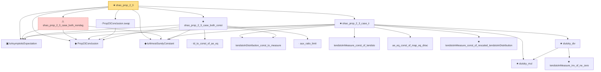

# Proof narrative — shao_prop_2_3

Root: **shao_prop_2_3** (theorem) `Statlib/LimitTheorems/shao_prop_2_3.lean:39` · topic `LimitTheorems`
Closure: 17 declarations across 17 files. Generated from `proof_graph.json` — no files were moved.

Reading order (foundations first, headline last):

  ▣ `IsAsymptoticExpectation` — structure · `Statlib/LimitTheorems/IsAsymptoticExpectation.lean:22`
  ◆ `Prop23Conclusion` — def · `Statlib/LimitTheorems/Prop23Conclusion.lean:17`
  ◆ `IsAlmostSurelyConstant` — def · `Statlib/LimitTheorems/IsAlmostSurelyConstant.lean:15`
    · `td_to_const_of_ae_eq` — lemma · `Statlib/LimitTheorems/td_to_const_of_ae_eq.lean:18`
    · `tendstoInDistribution_const_to_measure` — lemma · `Statlib/LimitTheorems/tendstoInDistribution_const_to_measure.lean:26`
    · `aux_ratio_limit` — lemma · `Statlib/LimitTheorems/aux_ratio_limit.lean:24`
  ★ `shao_prop_2_3_case_both_const` — theorem · `Statlib/LimitTheorems/shao_prop_2_3_case_both_const.lean:31`
  · `Prop23Conclusion.swap` — lemma · `Statlib/LimitTheorems/Prop23Conclusion_swap.lean:16`
    · `tendstoInMeasure_const_of_tendsto` — lemma · `Statlib/LimitTheorems/tendstoInMeasure_const_of_tendsto.lean:18`
    ★ `slutsky_mul` — theorem · `Statlib/LimitTheorems/slutsky_mul.lean:14`
    · `ae_eq_const_of_map_eq_dirac` — lemma · `Statlib/LimitTheorems/ae_eq_const_of_map_eq_dirac.lean:18`
    ★ `tendstoInMeasure_const_of_rescaled_tendstoInDistribution` — theorem · `Statlib/LimitTheorems/tendstoInMeasure_const_of_rescaled_tendstoInDistribution.lean:24`
      ★ `tendstoInMeasure_inv_of_ne_zero` — theorem · `Statlib/LimitTheorems/tendstoInMeasure_inv_of_ne_zero.lean:17`
    ★ `slutsky_div` — theorem · `Statlib/LimitTheorems/slutsky_div.lean:17`
  ★ `shao_prop_2_3_case_ii` — theorem · `Statlib/LimitTheorems/shao_prop_2_3_case_ii.lean:32`
  ⚠ `shao_prop_2_3_case_both_nondeg` — axiom · `Statlib/LimitTheorems/shao_prop_2_3_case_both_nondeg.lean:46`
★ `shao_prop_2_3` — theorem · `Statlib/LimitTheorems/shao_prop_2_3.lean:39` **← headline**

## Dependency diagram

