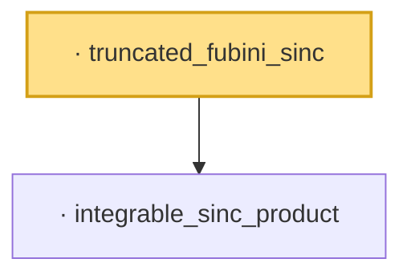

# Proof narrative — truncated_fubini_sinc

Root: **truncated_fubini_sinc** (lemma) `Statlib/LimitTheorems/truncated_fubini_sinc.lean:19` · topic `LimitTheorems`
Closure: 2 declarations across 2 files. Generated from `proof_graph.json` — no files were moved.

Reading order (foundations first, headline last):

  · `integrable_sinc_product` — lemma · `Statlib/LimitTheorems/integrable_sinc_product.lean:14`
· `truncated_fubini_sinc` — lemma · `Statlib/LimitTheorems/truncated_fubini_sinc.lean:19` **← headline**

## Dependency diagram

