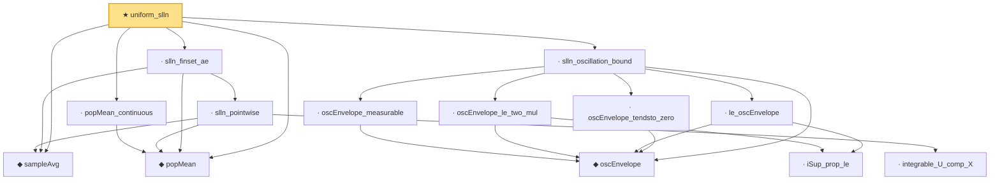

# Proof narrative — uniform_slln

Root: **uniform_slln** (theorem) `Statlib/LimitTheorems/uniform_slln.lean:20` · topic `LimitTheorems`
Closure: 14 declarations across 14 files. Generated from `proof_graph.json` — no files were moved.

Reading order (foundations first, headline last):

  ◆ `sampleAvg` — noncomputable def · `Statlib/LimitTheorems/sampleAvg.lean:12`  _(also used by 1: sampleAvg_continuous)_
  ◆ `popMean` — noncomputable def · `Statlib/LimitTheorems/popMean.lean:10`
  · `popMean_continuous` — lemma · `Statlib/LimitTheorems/popMean_continuous.lean:12`
    ◆ `oscEnvelope` — noncomputable def · `Statlib/LimitTheorems/oscEnvelope.lean:11`
    · `oscEnvelope_measurable` — lemma · `Statlib/LimitTheorems/oscEnvelope_measurable.lean:11`
      · `iSup_prop_le` — lemma · `Statlib/LimitTheorems/iSup_prop_le.lean:22`
    · `oscEnvelope_le_two_mul` — lemma · `Statlib/LimitTheorems/oscEnvelope_le_two_mul.lean:12`
    · `le_oscEnvelope` — lemma · `Statlib/LimitTheorems/le_oscEnvelope.lean:14`
    · `oscEnvelope_tendsto_zero` — lemma · `Statlib/LimitTheorems/oscEnvelope_tendsto_zero.lean:11`
  · `slln_oscillation_bound` — lemma · `Statlib/LimitTheorems/slln_oscillation_bound.lean:14`
      · `integrable_U_comp_X` — lemma · `Statlib/LimitTheorems/integrable_U_comp_X.lean:11`
    · `slln_pointwise` — lemma · `Statlib/LimitTheorems/slln_pointwise.lean:15`
  · `slln_finset_ae` — lemma · `Statlib/LimitTheorems/slln_finset_ae.lean:15`
★ `uniform_slln` — theorem · `Statlib/LimitTheorems/uniform_slln.lean:20` **← headline**

## Dependency diagram

