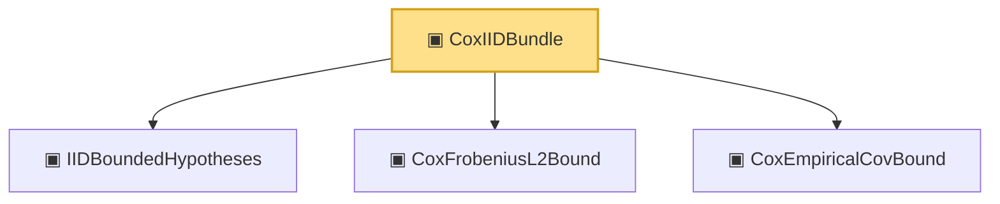

# Proof narrative — CoxIIDBundle

Root: **CoxIIDBundle** (structure) `Statlib/Mathlib/ProbabilityTheory/CoxCovOpNormBound.lean:247` · topic `Mathlib`
Closure: 4 declarations across 3 files. Generated from `proof_graph.json` — no files were moved.

Reading order (foundations first, headline last):

  ▣ `IIDBoundedHypotheses` — structure · `Statlib/Mathlib/ProbabilityTheory/CLTSums.lean:129`  _(also used by 8: toConclusion, bound_pos, mean_eq, …)_
  ▣ `CoxFrobeniusL2Bound` — structure · `Statlib/Mathlib/ProbabilityTheory/CoxCovOpNormBound.lean:141`  _(also used by 3: sq_M_pos, toOpNormBound, ofZeroDifference)_
  ▣ `CoxEmpiricalCovBound` — structure · `Statlib/Mathlib/ProbabilityTheory/RandomMatrixOpNorm.lean:294`
▣ `CoxIIDBundle` — structure · `Statlib/Mathlib/ProbabilityTheory/CoxCovOpNormBound.lean:247` **← headline**

## Dependency diagram

