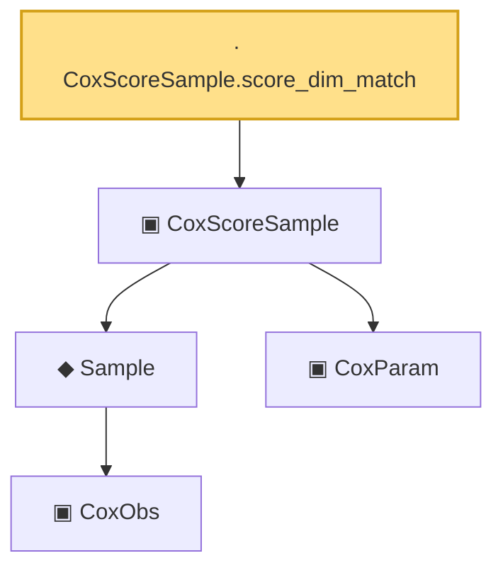

# Proof narrative — CoxScoreSample.score_dim_match

Root: **CoxScoreSample.score_dim_match** (lemma) `Statlib/Mathlib/ProbabilityTheory/CoxIIDInstance.lean:190` · topic `Mathlib`
Closure: 5 declarations across 2 files. Generated from `proof_graph.json` — no files were moved.

Reading order (foundations first, headline last):

      ▣ `CoxObs` — structure · `Statlib/CoxChangePoint/Foundation.lean:38`  _(also used by 42: TruncSample, benchmark_obs, coxScoreAt, …)_
    ◆ `Sample` — def · `Statlib/CoxChangePoint/Foundation.lean:127`  _(also used by 23: benchmark_sample, CoxLANExpansionHypothesis, coxLogRatio, …)_
    ▣ `CoxParam` — structure · `Statlib/CoxChangePoint/Foundation.lean:57`  _(also used by 72: liftAuto, concreteGn, buildLemmaS1Data, …)_
  ▣ `CoxScoreSample` — structure · `Statlib/Mathlib/ProbabilityTheory/CoxIIDInstance.lean:92`  _(also used by 2: CoxScoreSample.toIIDBoundedHypotheses, fromCoxScoreSample)_
· `CoxScoreSample.score_dim_match` — lemma · `Statlib/Mathlib/ProbabilityTheory/CoxIIDInstance.lean:190` **← headline**

## Dependency diagram

