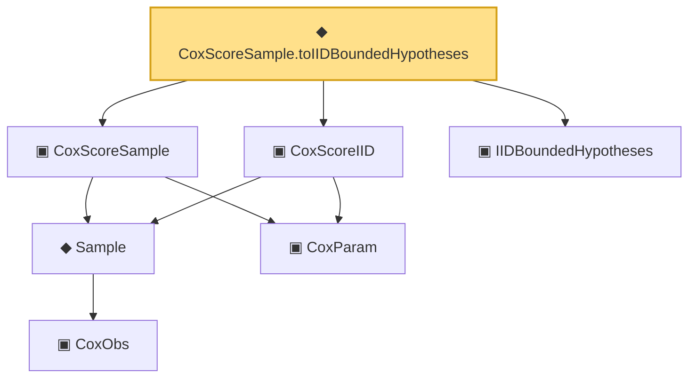

# Proof narrative — CoxScoreSample.toIIDBoundedHypotheses

Root: **CoxScoreSample.toIIDBoundedHypotheses** (def) `Statlib/Mathlib/ProbabilityTheory/CoxIIDInstance.lean:154` · topic `Mathlib`
Closure: 7 declarations across 3 files. Generated from `proof_graph.json` — no files were moved.

Reading order (foundations first, headline last):

      ▣ `CoxObs` — structure · `Statlib/CoxChangePoint/Foundation.lean:38`  _(also used by 42: TruncSample, benchmark_obs, coxScoreAt, …)_
    ◆ `Sample` — def · `Statlib/CoxChangePoint/Foundation.lean:127`  _(also used by 22: benchmark_sample, CoxLANExpansionHypothesis, coxLogRatio, …)_
    ▣ `CoxParam` — structure · `Statlib/CoxChangePoint/Foundation.lean:57`  _(also used by 71: liftAuto, concreteGn, buildLemmaS1Data, …)_
  ▣ `CoxScoreSample` — structure · `Statlib/Mathlib/ProbabilityTheory/CoxIIDInstance.lean:92`  _(also used by 2: CoxScoreSample.score_dim_match, fromCoxScoreSample)_
  ▣ `CoxScoreIID` — structure · `Statlib/Mathlib/ProbabilityTheory/CoxIIDInstance.lean:121`  _(also used by 1: fromCoxScoreSample)_
  ▣ `IIDBoundedHypotheses` — structure · `Statlib/Mathlib/ProbabilityTheory/CLTSums.lean:129`  _(also used by 8: toConclusion, bound_pos, mean_eq, …)_
◆ `CoxScoreSample.toIIDBoundedHypotheses` — def · `Statlib/Mathlib/ProbabilityTheory/CoxIIDInstance.lean:154` **← headline**

## Dependency diagram

