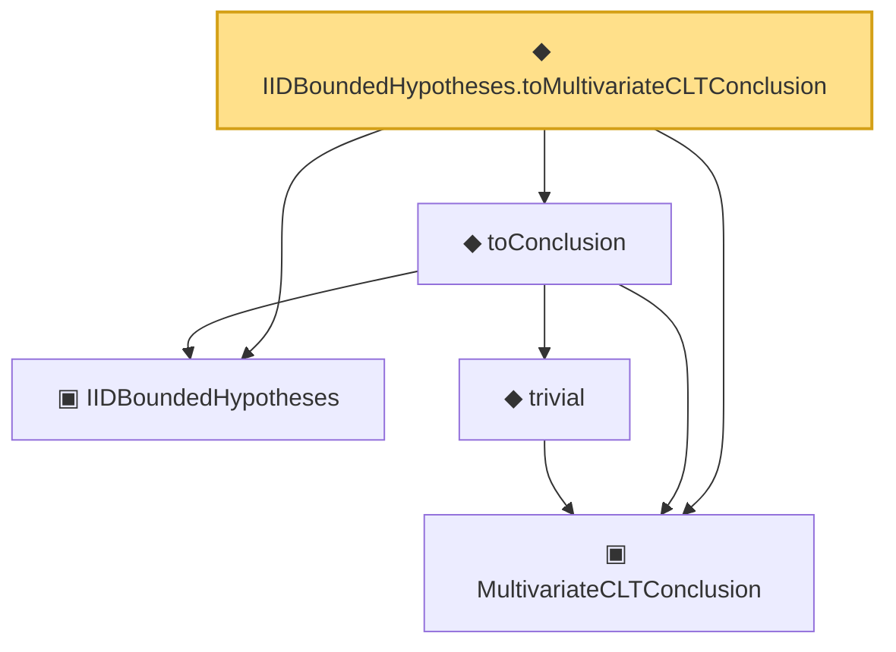

# Proof narrative — IIDBoundedHypotheses.toMultivariateCLTConclusion

Root: **IIDBoundedHypotheses.toMultivariateCLTConclusion** (noncomputable def) `Statlib/Mathlib/ProbabilityTheory/UnivariateCLTBridge.lean:203` · topic `Mathlib`
Closure: 5 declarations across 3 files. Generated from `proof_graph.json` — no files were moved.

Reading order (foundations first, headline last):

  ▣ `IIDBoundedHypotheses` — structure · `Statlib/Mathlib/ProbabilityTheory/CLTSums.lean:129`  _(also used by 7: bound_pos, mean_eq, aestronglyMeasurable, …)_
  ▣ `MultivariateCLTConclusion` — structure · `Statlib/Mathlib/ProbabilityTheory/MultivariateCLT.lean:138`  _(also used by 7: iidBounded, centralLimit_to_multivariateCLTConclusion, MultivariateCLTConclusion.toScoreCLT, …)_
    ◆ `trivial` — def · `Statlib/Mathlib/ProbabilityTheory/MultivariateCLT.lean:161`  _(also used by 4: centralLimit_to_multivariateCLTConclusion, multivariateCLTOfCramerWold, fromCoxScoreSample, …)_
  ◆ `toConclusion` — def · `Statlib/Mathlib/ProbabilityTheory/CLTSums.lean:171`  _(also used by 2: iidBounded, fromCoxScoreSample)_
◆ `IIDBoundedHypotheses.toMultivariateCLTConclusion` — noncomputable def · `Statlib/Mathlib/ProbabilityTheory/UnivariateCLTBridge.lean:203` **← headline**

## Dependency diagram

