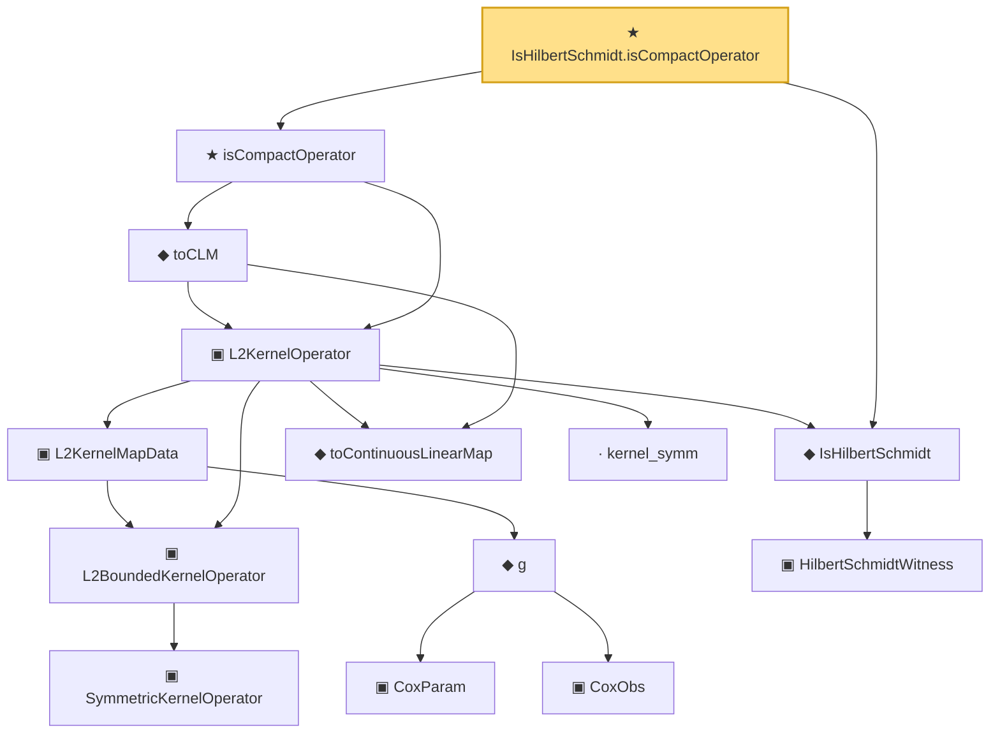

# Proof narrative — IsHilbertSchmidt.isCompactOperator

Root: **IsHilbertSchmidt.isCompactOperator** (theorem) `Statlib/Mathlib/Analysis/HilbertSchmidt.lean:172` · topic `Mathlib`
Closure: 14 declarations across 6 files. Generated from `proof_graph.json` — no files were moved.

Reading order (foundations first, headline last):

          ▣ `SymmetricKernelOperator` — structure · `Statlib/CoxChangePoint/SpectralOperator.lean:103`  _(also used by 4: L2BoundedKernelOperator.ofSymmetric, ofEmpiricalCov, HasEigendecomposition, …)_
      ▣ `L2BoundedKernelOperator` — structure · `Statlib/CoxChangePoint/L2Operator.lean:212`  _(also used by 5: integralAction_integral_sq_le, L2BoundedKernelOperator.ofSymmetric, integralAction_smul, …)_
          ▣ `CoxParam` — structure · `Statlib/CoxChangePoint/Foundation.lean:57`  _(also used by 72: liftAuto, concreteGn, buildLemmaS1Data, …)_
          ▣ `CoxObs` — structure · `Statlib/CoxChangePoint/Foundation.lean:38`  _(also used by 42: TruncSample, benchmark_obs, coxScoreAt, …)_
        ◆ `g` — noncomputable def · `Statlib/CoxChangePoint/Foundation.lean:68`  _(also used by 18: AssumptionA7, exponential_moment_bound, HasFirstOrderTaylor, …)_
      ▣ `L2KernelMapData` — structure · `Statlib/CoxChangePoint/L2OperatorMap.lean:204`  _(also used by 12: SpectralFamilyHS.phiRepr, SpectralFamilyHS.phiRepr_meas, SpectralFamilyHS.toEigensystem, …)_
        ▣ `HilbertSchmidtWitness` — structure · `Statlib/Mathlib/Analysis/HilbertSchmidt.lean:74`  _(also used by 1: toHilbertSchmidtWitness)_
  ◆ `IsHilbertSchmidt` — def · `Statlib/Mathlib/Analysis/HilbertSchmidt.lean:88`  _(also used by 9: IsHilbertSchmidt.isCompactOperator_via_truncate_complete, IsHilbertSchmidt_zero, IsHilbertSchmidt.smul, …)_
      ◆ `toContinuousLinearMap` — def · `Statlib/CoxChangePoint/L2OperatorMap.lean:239`  _(also used by 11: SpectralFamilyHS.phiRepr, SpectralFamilyHS.phiRepr_meas, SpectralFamilyHS.toEigensystem, …)_
      · `kernel_symm` — lemma · `Statlib/CoxChangePoint/L2Operator.lean:233`
    ▣ `L2KernelOperator` — structure · `Statlib/Mathlib/Analysis/L2CompactSAInstance.lean:92`  _(also used by 4: isSymmetric_clm, isSelfAdjoint_clm, toSpectralTheoremCompactSA, …)_
    ◆ `toCLM` — def · `Statlib/Mathlib/Analysis/L2CompactSAInstance.lean:119`  _(also used by 4: isSymmetric_clm, isSelfAdjoint_clm, toSpectralTheoremCompactSA, …)_
  ★ `isCompactOperator` — theorem · `Statlib/Mathlib/Analysis/L2CompactSAInstance.lean:159`
★ `IsHilbertSchmidt.isCompactOperator` — theorem · `Statlib/Mathlib/Analysis/HilbertSchmidt.lean:172` **← headline**

## Dependency diagram

