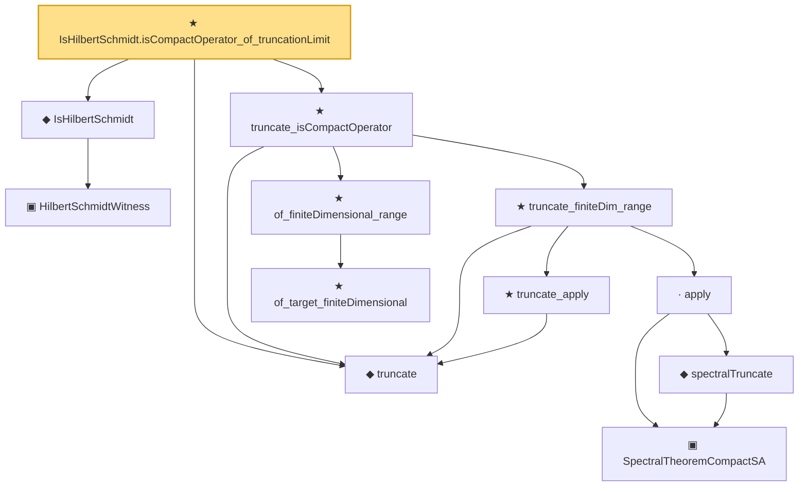

# Proof narrative — IsHilbertSchmidt.isCompactOperator_of_truncationLimit

Root: **IsHilbertSchmidt.isCompactOperator_of_truncationLimit** (theorem) `Statlib/Mathlib/Analysis/HilbertSchmidtCompact.lean:153` · topic `Mathlib`
Closure: 12 declarations across 4 files. Generated from `proof_graph.json` — no files were moved.

Reading order (foundations first, headline last):

    ▣ `HilbertSchmidtWitness` — structure · `Statlib/Mathlib/Analysis/HilbertSchmidt.lean:74`  _(also used by 1: toHilbertSchmidtWitness)_
  ◆ `IsHilbertSchmidt` — def · `Statlib/Mathlib/Analysis/HilbertSchmidt.lean:88`  _(also used by 10: IsHilbertSchmidt.isCompactOperator_via_truncate_complete, IsHilbertSchmidt_zero, IsHilbertSchmidt.smul, …)_
  ◆ `truncate` — noncomputable def · `Statlib/Mathlib/Analysis/HilbertSchmidtCompact.lean:92`
      ★ `of_target_finiteDimensional` — theorem · `Statlib/Mathlib/Analysis/SpectralCompactSelfAdjoint.lean:111`
    ★ `of_finiteDimensional_range` — theorem · `Statlib/Mathlib/Analysis/SpectralCompactSelfAdjoint.lean:131`  _(also used by 2: isCompactOperator_trunc, spectralTruncate_isCompactOperator)_
      ★ `truncate_apply` — theorem · `Statlib/Mathlib/Analysis/HilbertSchmidtCompact.lean:98`
        ▣ `SpectralTheoremCompactSA` — structure · `Statlib/Mathlib/Analysis/SpectralCompactSelfAdjoint.lean:299`  _(also used by 31: SpectralEigenbasisIsTotal, SpectralTheoremCompactSA.toHilbertBasis, inner_eigenfn_spectralTruncate_lt, …)_
        ◆ `spectralTruncate` — noncomputable def · `Statlib/Mathlib/Analysis/SpectralTruncation.lean:98`  _(also used by 17: inner_eigenfn_spectralTruncate_lt, inner_eigenfn_spectralTruncate_ge, inner_eigenfn_residual, …)_
      · `apply` — lemma · `Statlib/Mathlib/Analysis/SpectralTruncation.lean:107`  _(also used by 13: inner_eigenfn_spectralTruncate_lt, inner_eigenfn_spectralTruncate_ge, isCompactOperator_of_op_norm_tendsto, …)_
    ★ `truncate_finiteDim_range` — theorem · `Statlib/Mathlib/Analysis/HilbertSchmidtCompact.lean:110`
  ★ `truncate_isCompactOperator` — theorem · `Statlib/Mathlib/Analysis/HilbertSchmidtCompact.lean:132`
★ `IsHilbertSchmidt.isCompactOperator_of_truncationLimit` — theorem · `Statlib/Mathlib/Analysis/HilbertSchmidtCompact.lean:153` **← headline**

## Dependency diagram

