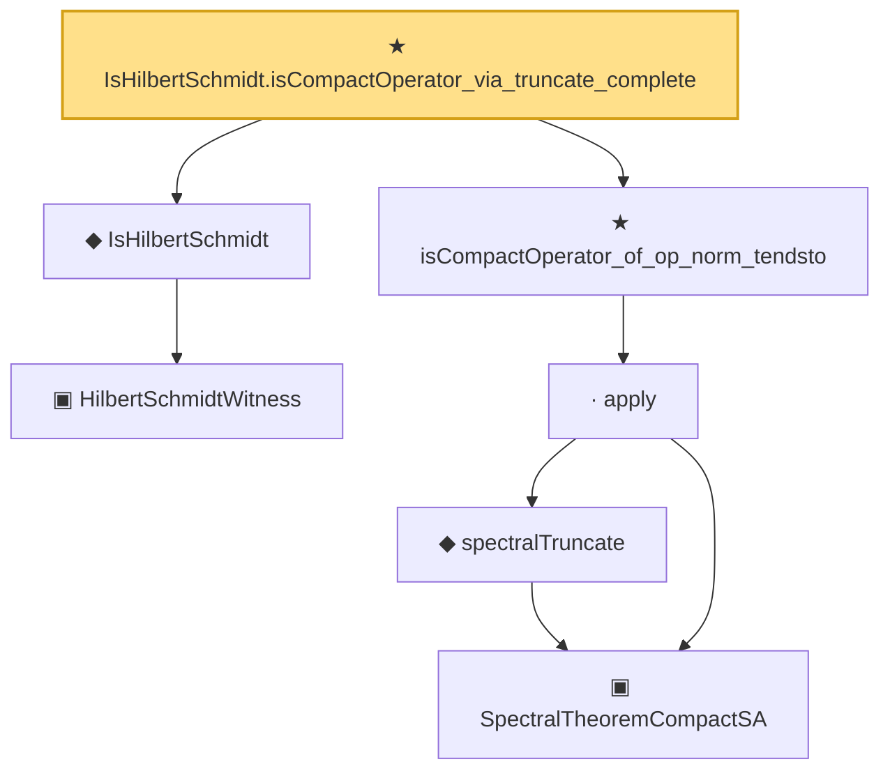

# Proof narrative — IsHilbertSchmidt.isCompactOperator_via_truncate_complete

Root: **IsHilbertSchmidt.isCompactOperator_via_truncate_complete** (theorem) `Statlib/Mathlib/Analysis/CompactClosed.lean:132` · topic `Mathlib`
Closure: 7 declarations across 4 files. Generated from `proof_graph.json` — no files were moved.

Reading order (foundations first, headline last):

    ▣ `HilbertSchmidtWitness` — structure · `Statlib/Mathlib/Analysis/HilbertSchmidt.lean:74`  _(also used by 1: toHilbertSchmidtWitness)_
  ◆ `IsHilbertSchmidt` — def · `Statlib/Mathlib/Analysis/HilbertSchmidt.lean:88`  _(also used by 10: IsHilbertSchmidt_zero, IsHilbertSchmidt.smul, hilbertSchmidtNormSq, …)_
      ▣ `SpectralTheoremCompactSA` — structure · `Statlib/Mathlib/Analysis/SpectralCompactSelfAdjoint.lean:299`  _(also used by 31: SpectralEigenbasisIsTotal, SpectralTheoremCompactSA.toHilbertBasis, inner_eigenfn_spectralTruncate_lt, …)_
      ◆ `spectralTruncate` — noncomputable def · `Statlib/Mathlib/Analysis/SpectralTruncation.lean:98`  _(also used by 17: inner_eigenfn_spectralTruncate_lt, inner_eigenfn_spectralTruncate_ge, inner_eigenfn_residual, …)_
    · `apply` — lemma · `Statlib/Mathlib/Analysis/SpectralTruncation.lean:107`  _(also used by 13: inner_eigenfn_spectralTruncate_lt, inner_eigenfn_spectralTruncate_ge, spectralGap_le_dist_of_mem, …)_
  ★ `isCompactOperator_of_op_norm_tendsto` — theorem · `Statlib/Mathlib/Analysis/CompactClosed.lean:97`
★ `IsHilbertSchmidt.isCompactOperator_via_truncate_complete` — theorem · `Statlib/Mathlib/Analysis/CompactClosed.lean:132` **← headline**

## Dependency diagram

