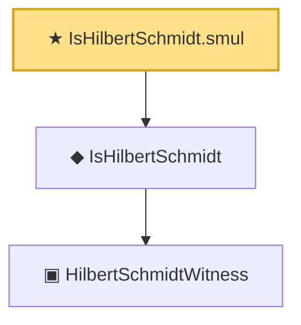

# Proof narrative — IsHilbertSchmidt.smul

Root: **IsHilbertSchmidt.smul** (theorem) `Statlib/Mathlib/Analysis/HilbertSchmidt.lean:105` · topic `Mathlib`
Closure: 3 declarations across 1 files. Generated from `proof_graph.json` — no files were moved.

Reading order (foundations first, headline last):

    ▣ `HilbertSchmidtWitness` — structure · `Statlib/Mathlib/Analysis/HilbertSchmidt.lean:74`  _(also used by 1: toHilbertSchmidtWitness)_
  ◆ `IsHilbertSchmidt` — def · `Statlib/Mathlib/Analysis/HilbertSchmidt.lean:88`  _(also used by 10: IsHilbertSchmidt.isCompactOperator_via_truncate_complete, IsHilbertSchmidt_zero, hilbertSchmidtNormSq, …)_
★ `IsHilbertSchmidt.smul` — theorem · `Statlib/Mathlib/Analysis/HilbertSchmidt.lean:105` **← headline**

## Dependency diagram

