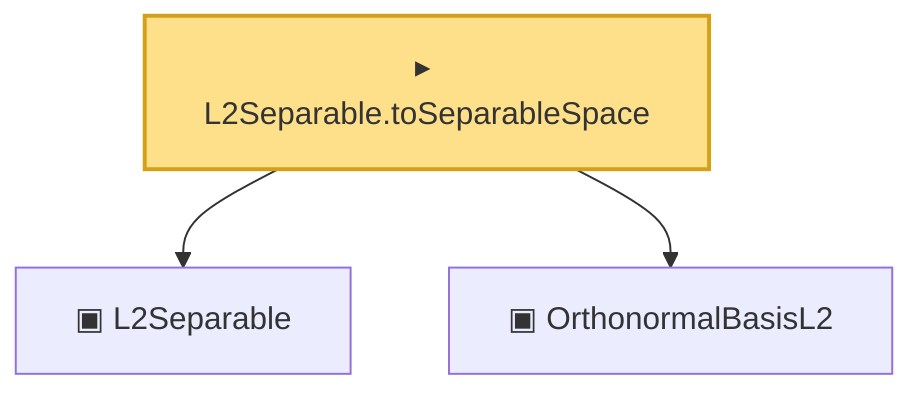

# Proof narrative — L2Separable.toSeparableSpace

Root: **L2Separable.toSeparableSpace** (instance) `Statlib/Mathlib/MeasureTheory/L2Separable.lean:88` · topic `Mathlib`
Closure: 3 declarations across 1 files. Generated from `proof_graph.json` — no files were moved.

Reading order (foundations first, headline last):

  ▣ `L2Separable` — class · `Statlib/Mathlib/MeasureTheory/L2Separable.lean:74`  _(also used by 2: L2Separable.ofIsSeparable, L2Separable_of_isSeparable)_
  ▣ `OrthonormalBasisL2` — structure · `Statlib/Mathlib/MeasureTheory/L2Separable.lean:108`  _(also used by 8: basis_norm_one, basis_orthogonal, basis_inner_self, …)_
▸ `L2Separable.toSeparableSpace` — instance · `Statlib/Mathlib/MeasureTheory/L2Separable.lean:88` **← headline**

## Dependency diagram

