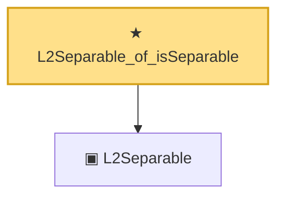

# Proof narrative — L2Separable_of_isSeparable

Root: **L2Separable_of_isSeparable** (theorem) `Statlib/Mathlib/MeasureTheory/L2Separable.lean:235` · topic `Mathlib`
Closure: 2 declarations across 1 files. Generated from `proof_graph.json` — no files were moved.

Reading order (foundations first, headline last):

  ▣ `L2Separable` — class · `Statlib/Mathlib/MeasureTheory/L2Separable.lean:74`  _(also used by 2: L2Separable.ofIsSeparable, L2Separable.toSeparableSpace)_
★ `L2Separable_of_isSeparable` — theorem · `Statlib/Mathlib/MeasureTheory/L2Separable.lean:235` **← headline**

## Dependency diagram

