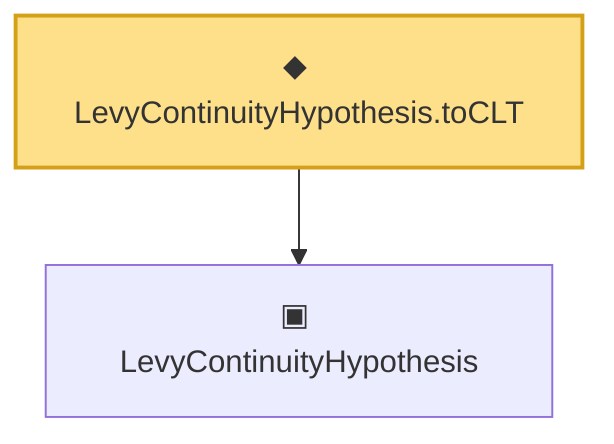

# Proof narrative — LevyContinuityHypothesis.toCLT

Root: **LevyContinuityHypothesis.toCLT** (def) `Statlib/Mathlib/ProbabilityTheory/LevyContinuity.lean:161` · topic `Mathlib`
Closure: 2 declarations across 1 files. Generated from `proof_graph.json` — no files were moved.

Reading order (foundations first, headline last):

  ▣ `LevyContinuityHypothesis` — structure · `Statlib/Mathlib/ProbabilityTheory/LevyContinuity.lean:74`  _(also used by 4: charFun_zero_eq, charFun_norm_le_one, refl, …)_
◆ `LevyContinuityHypothesis.toCLT` — def · `Statlib/Mathlib/ProbabilityTheory/LevyContinuity.lean:161` **← headline**

## Dependency diagram

