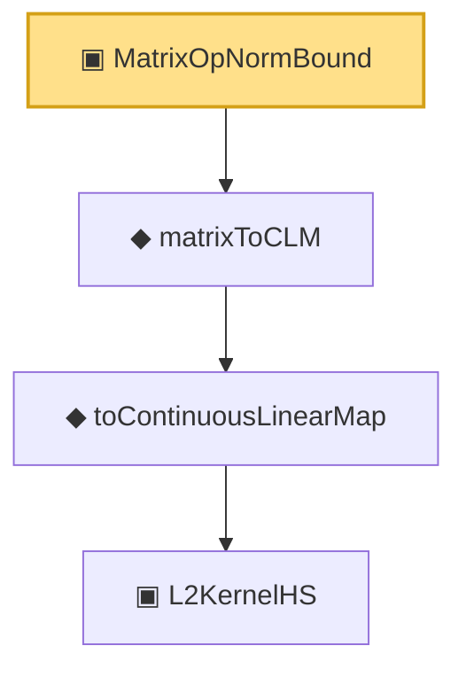

# Proof narrative — MatrixOpNormBound

Root: **MatrixOpNormBound** (structure) `Statlib/Mathlib/ProbabilityTheory/CoxCovOpNormBound.lean:121` · topic `Mathlib`
Closure: 4 declarations across 2 files. Generated from `proof_graph.json` — no files were moved.

Reading order (foundations first, headline last):

      ▣ `L2KernelHS` — structure · `Statlib/Mathlib/Analysis/HilbertSchmidt.lean:196`  _(also used by 4: kernelNormSq, kernelNormSq_nonneg, isHilbertSchmidt, …)_
    ◆ `toContinuousLinearMap` — noncomputable def · `Statlib/Mathlib/Analysis/HilbertSchmidt.lean:232`  _(also used by 1: isHilbertSchmidt)_
  ◆ `matrixToCLM` — noncomputable def · `Statlib/Mathlib/ProbabilityTheory/CoxCovOpNormBound.lean:105`
▣ `MatrixOpNormBound` — structure · `Statlib/Mathlib/ProbabilityTheory/CoxCovOpNormBound.lean:121` **← headline**

## Dependency diagram

