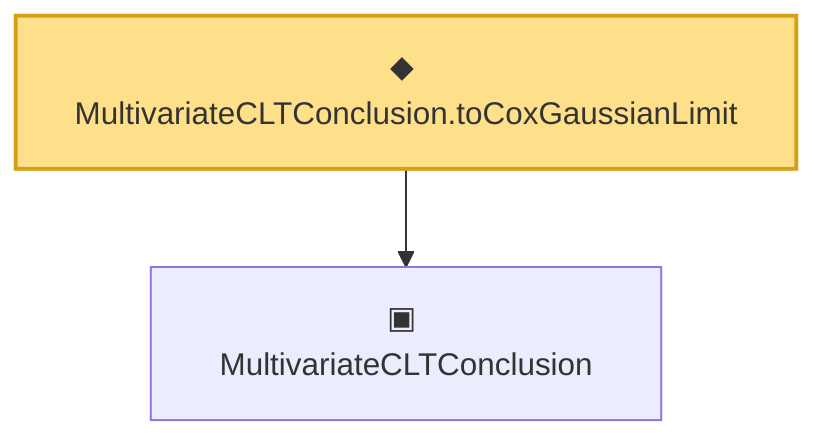

# Proof narrative — MultivariateCLTConclusion.toCoxGaussianLimit

Root: **MultivariateCLTConclusion.toCoxGaussianLimit** (def) `Statlib/Mathlib/ProbabilityTheory/MultivariateCLT.lean:215` · topic `Mathlib`
Closure: 2 declarations across 1 files. Generated from `proof_graph.json` — no files were moved.

Reading order (foundations first, headline last):

  ▣ `MultivariateCLTConclusion` — structure · `Statlib/Mathlib/ProbabilityTheory/MultivariateCLT.lean:138`  _(also used by 9: toConclusion, iidBounded, centralLimit_to_multivariateCLTConclusion, …)_
◆ `MultivariateCLTConclusion.toCoxGaussianLimit` — def · `Statlib/Mathlib/ProbabilityTheory/MultivariateCLT.lean:215` **← headline**

## Dependency diagram

