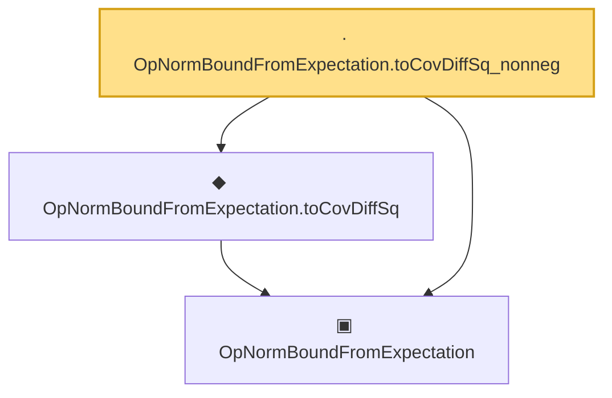

# Proof narrative — OpNormBoundFromExpectation.toCovDiffSq_nonneg

Root: **OpNormBoundFromExpectation.toCovDiffSq_nonneg** (lemma) `Statlib/Mathlib/ProbabilityTheory/RandomMatrixOpNorm.lean:267` · topic `Mathlib`
Closure: 3 declarations across 1 files. Generated from `proof_graph.json` — no files were moved.

Reading order (foundations first, headline last):

  ▣ `OpNormBoundFromExpectation` — structure · `Statlib/Mathlib/ProbabilityTheory/RandomMatrixOpNorm.lean:147`  _(also used by 3: toOpNormBound, OpNormBoundFromExpectation.tendsto_in_prob, OpNormBoundFromExpectation.toCovDiffSq_integral_le)_
  ◆ `OpNormBoundFromExpectation.toCovDiffSq` — noncomputable def · `Statlib/Mathlib/ProbabilityTheory/RandomMatrixOpNorm.lean:259`  _(also used by 1: OpNormBoundFromExpectation.toCovDiffSq_integral_le)_
· `OpNormBoundFromExpectation.toCovDiffSq_nonneg` — lemma · `Statlib/Mathlib/ProbabilityTheory/RandomMatrixOpNorm.lean:267` **← headline**

## Dependency diagram

