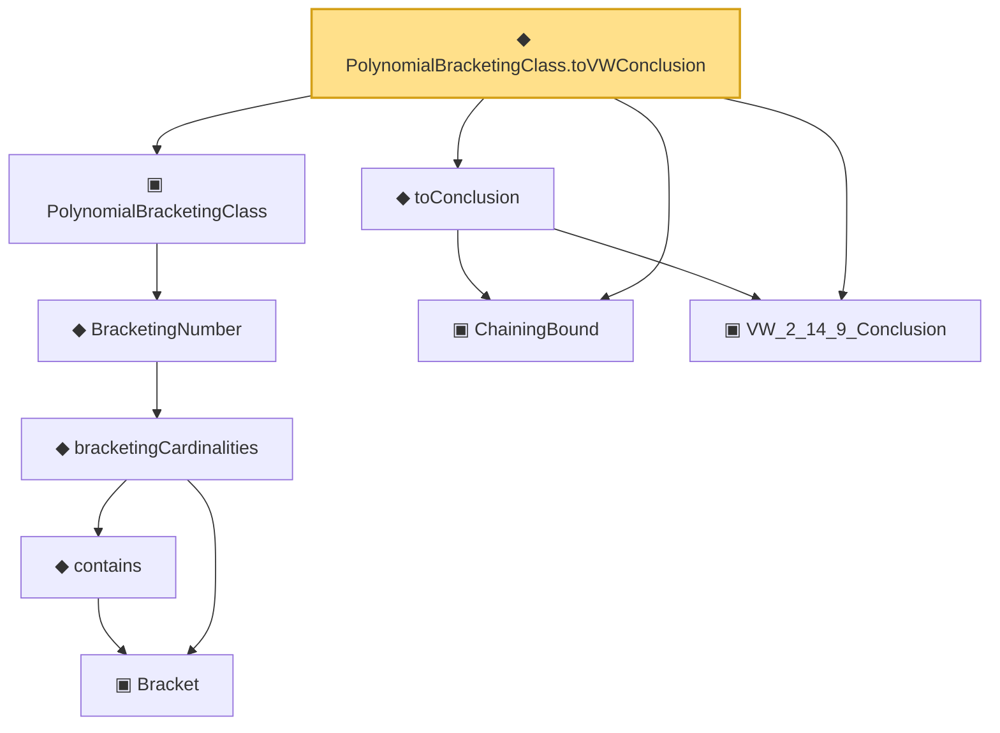

# Proof narrative — PolynomialBracketingClass.toVWConclusion

Root: **PolynomialBracketingClass.toVWConclusion** (def) `Statlib/Mathlib/EmpiricalProcess/VWPolynomialClass.lean:190` · topic `Mathlib`
Closure: 9 declarations across 5 files. Generated from `proof_graph.json` — no files were moved.

Reading order (foundations first, headline last):

        ▣ `Bracket` — structure · `Statlib/CoxChangePoint/BracketingEntropy.lean:58`  _(also used by 3: lower_le_of_contains, le_upper_of_contains, HasBracketing)_
        ◆ `contains` — def · `Statlib/CoxChangePoint/BracketingEntropy.lean:79`  _(also used by 3: lower_le_of_contains, le_upper_of_contains, HasBracketing)_
      ◆ `bracketingCardinalities` — def · `Statlib/CoxChangePoint/BracketingEntropy.lean:111`  _(also used by 3: BracketingNumber_lt_top_of_hasBracketing, hasBracketing_of_bracketingNumber_lt_top, coveringLeBracketing_trivial_of_no_bracketing)_
    ◆ `BracketingNumber` — noncomputable def · `Statlib/CoxChangePoint/BracketingEntropy.lean:120`  _(also used by 6: BracketingNumber_lt_top_of_hasBracketing, hasBracketing_of_bracketingNumber_lt_top, bracketingEntropy, …)_
  ▣ `PolynomialBracketingClass` — structure · `Statlib/Mathlib/EmpiricalProcess/BracketingIntegralConv.lean:164`  _(also used by 13: bound_pos, polynomialBracketingClass_log_bracketing_le, polynomialBracketingClass_sqrt_log_bracketing_le, …)_
  ▣ `ChainingBound` — structure · `Statlib/CoxChangePoint/ChainingRecursion.lean:254`  _(also used by 2: PolynomialBracketingClass.toChainingBound, PolynomialBracketingClass.toVWConclusion_C)_
  ▣ `VW_2_14_9_Conclusion` — structure · `Statlib/CoxChangePoint/ChainingProof.lean:226`  _(also used by 7: VW_2_14_9_Conclusion.tail_bound_no_sqrt, unifConv_of_VW_2_14_9_conclusion, CoxBaselineHypotheses.hUnif_from_VW_2_14_9, …)_
  ◆ `toConclusion` — def · `Statlib/CoxChangePoint/ChainingRecursion.lean:286`
◆ `PolynomialBracketingClass.toVWConclusion` — def · `Statlib/Mathlib/EmpiricalProcess/VWPolynomialClass.lean:190` **← headline**

## Dependency diagram

