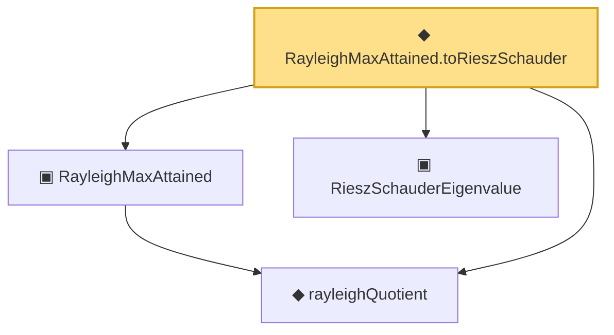

# Proof narrative — RayleighMaxAttained.toRieszSchauder

Root: **RayleighMaxAttained.toRieszSchauder** (noncomputable def) `Statlib/Mathlib/Analysis/RayleighMax.lean:172` · topic `Mathlib`
Closure: 4 declarations across 2 files. Generated from `proof_graph.json` — no files were moved.

Reading order (foundations first, headline last):

  ◆ `rayleighQuotient` — noncomputable def · `Statlib/Mathlib/Analysis/RayleighMax.lean:81`  _(also used by 3: rayleighQuotient_continuous, rayleighQuotient_bounded_by_op_norm, rayleigh_zero_op)_
  ▣ `RayleighMaxAttained` — structure · `Statlib/Mathlib/Analysis/RayleighMax.lean:138`  _(also used by 2: rayleighMaxAttained_via_BanachAlaoglu, rayleigh_max_is_eigenvector)_
  ▣ `RieszSchauderEigenvalue` — structure · `Statlib/Mathlib/Analysis/RieszSchauder.lean:79`  _(also used by 1: riesz_schauder_zero)_
◆ `RayleighMaxAttained.toRieszSchauder` — noncomputable def · `Statlib/Mathlib/Analysis/RayleighMax.lean:172` **← headline**

## Dependency diagram

