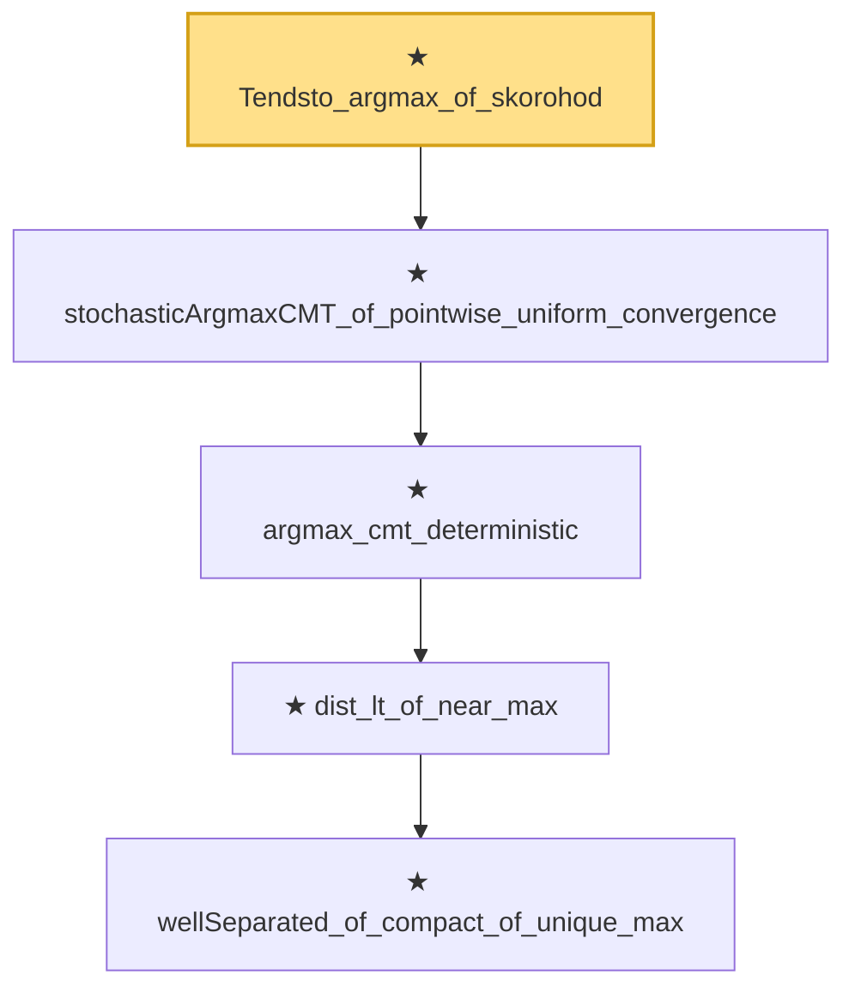

# Proof narrative — Tendsto_argmax_of_skorohod

Root: **Tendsto_argmax_of_skorohod** (theorem) `Statlib/Mathlib/ProbabilityTheory/SkorohodArgmax.lean:170` · topic `Mathlib`
Closure: 5 declarations across 4 files. Generated from `proof_graph.json` — no files were moved.

Reading order (foundations first, headline last):

        ★ `wellSeparated_of_compact_of_unique_max` — theorem · `Statlib/CoxChangePoint/Identifiability.lean:43`  _(also used by 1: CoxIdentifiability.wellSeparated)_
      ★ `dist_lt_of_near_max` — theorem · `Statlib/CoxChangePoint/Identifiability.lean:97`
    ★ `argmax_cmt_deterministic` — theorem · `Statlib/Mathlib/ProbabilityTheory/ArgmaxCMT.lean:76`  _(also used by 1: argmax_consistency_from_uniform_conv)_
  ★ `stochasticArgmaxCMT_of_pointwise_uniform_convergence` — theorem · `Statlib/Mathlib/ProbabilityTheory/StochasticArgmax.lean:127`
★ `Tendsto_argmax_of_skorohod` — theorem · `Statlib/Mathlib/ProbabilityTheory/SkorohodArgmax.lean:170` **← headline**

## Dependency diagram

