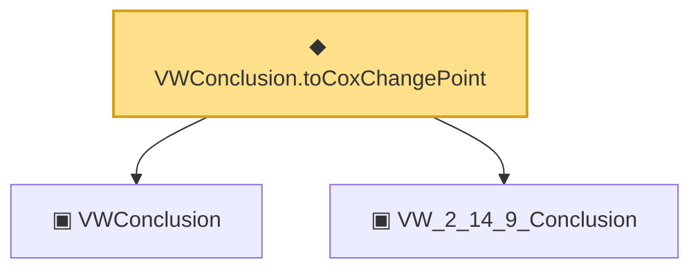

# Proof narrative — VWConclusion.toCoxChangePoint

Root: **VWConclusion.toCoxChangePoint** (def) `Statlib/Mathlib/EmpiricalProcess/VWChaining.lean:616` · topic `Mathlib`
Closure: 3 declarations across 2 files. Generated from `proof_graph.json` — no files were moved.

Reading order (foundations first, headline last):

  ▣ `VWConclusion` — structure · `Statlib/Mathlib/EmpiricalProcess/VWChaining.lean:448`  _(also used by 3: tail_bound_no_sqrt, vw_2_14_9, unifConv_of_VWConclusion)_
  ▣ `VW_2_14_9_Conclusion` — structure · `Statlib/CoxChangePoint/ChainingProof.lean:226`  _(also used by 8: VW_2_14_9_Conclusion.tail_bound_no_sqrt, unifConv_of_VW_2_14_9_conclusion, toConclusion, …)_
◆ `VWConclusion.toCoxChangePoint` — def · `Statlib/Mathlib/EmpiricalProcess/VWChaining.lean:616` **← headline**

## Dependency diagram

